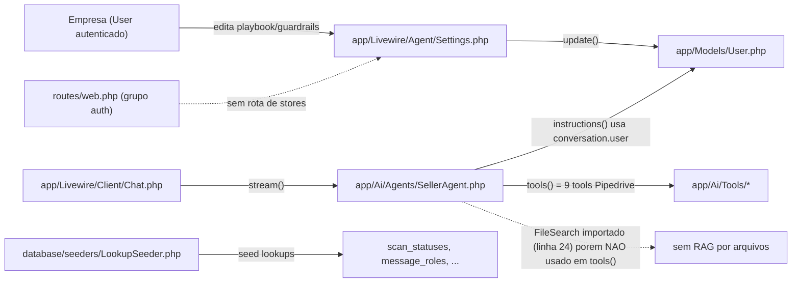
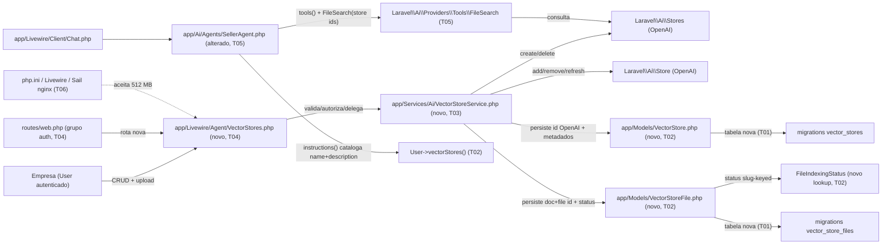

# Implementation Plan

## Request Summary
- Objective: dar a cada empresa (`User`/tenant) uma base documental própria (RAG) para o `SellerAgent`, com UI Livewire de CRUD de vector stores + upload/remoção de arquivos, integração OpenAI via `laravel/ai` v0, e o wiring da tool nativa `FileSearch` escopada aos stores da empresa da conversa.
- Scope:
  - In: componente Livewire de gestão (CRUD store + upload/remoção de arquivo), `VectorStoreService` (chamadas OpenAI + rollback + status), persistência local (`vector_stores` / `vector_store_files` + lookup de status), wiring de `FileSearch` no `SellerAgent` (RF-09/RF-10), catálogo nome+descrição em `instructions()` (RF-11), ajustes de infra de upload 512 MB (RNF-06).
  - Out: admin de stores por terceiros, compartilhamento entre empresas, ingestão por URL/conector/sync, re-chunking manual, versionamento, tools além de `FileSearch`, mudança na resolução de empresa (segue `Conversation.user_id`), acesso do cliente final à gestão.
- Tier: standard
- Architecture references: `AGENTS.md`, `docs/agents/architecture.md`, `docs/agents/domain_rules.md`, `docs/agents/data_model.md`, `docs/agents/coding_guidelines.md`, `docs/agents/api_contracts.md`, `docs/agents/tech_stack.md` — todas presentes; plano validado contra a arquitetura documentada e o código em disco.

### Regras de arquitetura aplicadas (fonte → onde no plano)
- **Fat service / thin component** (`coding_guidelines.md` §5; espelha `Connect::connect` → `CrmDriverManager`): toda chamada OpenAI, rollback e status vivem em `App\Services\Ai\VectorStoreService` (T03); o Livewire `Agent\VectorStores` (T04) só valida/autoriza/delega, como `Agent\Settings` e `Connect`.
- **Todas as páginas são Livewire** (`AGENTS.md` §2, `api_contracts.md`): gestão é componente Livewire sob `app/Livewire/Agent/`, rota nova em `routes/web.php` sob `middleware('auth')` (grupo do painel), sem controller/REST/`routes/api.php` (T04).
- **Lookup slug-keyed, sem enum** (`coding_guidelines.md` §4, `data_model.md`): status de indexação é tabela `file_indexing_statuses` com `Concerns\IsLookup` + `LookupSeeder`, como `scan_statuses` (T01/T02).
- **Isolamento multi-tenant por `User`** (`domain_rules.md`; espelha `abort_unless` de `CompanySelection::select`): toda query escopada a `auth()->user()`; operação sobre store de outra empresa → `abort(403)` (T04, RNF-01).
- **Strict typing + property promotion + curly braces** (`coding_guidelines.md` §1–3, PHPStan level 7): serviço e componente com tipos explícitos e PHPDoc; sem violações de nível 7 (T03/T04).
- **Strings PT-BR, identificadores em inglês** (`coding_guidelines.md` §7): toda UI/erro em PT-BR (T04, RNF-04).
- **Sem soft delete no MVP** (`.spec/init/database-schema.md`): exclusão física; `onDelete cascade` nas FKs (T01).
- **Upsert/persistência pós-confirmação remota** (espelha `ScanCrmConnection` ordem-de-passos): criação persiste local só após id OpenAI (T03, RNF-02); exclusão remove local só após confirmação/404 remoto (T03, RNF-05).

## AS IS — Componentes impactados

Legenda: hoje `Agent/Settings` grava playbook/guardrails no `User`; `SellerAgent::tools()` (verificado em `app/Ai/Agents/SellerAgent.php:144-157`) retorna 9 tools Pipedrive e NÃO instancia `FileSearch` (o import na linha 24 está presente porém ocioso). Não há rota nem componente de gestão de stores, nem tabelas de vector store, nem lookup de status de indexação.

## TO BE — Componentes propostos

Legenda: `Agent\VectorStores` (T04, UI-01..UI-04) delega a `VectorStoreService` (T03, RF-01..RF-08/RNF-02/RNF-05), que cria/apaga stores e arquivos na OpenAI e persiste ids localmente em `vector_stores`/`vector_store_files` (T01/T02) com status em lookup `file_indexing_statuses` (T02). `SellerAgent` (T05) ganha `FileSearch` escopada (RF-09/RF-10, CT-01) e catálogo em `instructions()` (RF-11) via `User->vectorStores()`. T06 garante a stack de upload de 512 MB (RNF-06).

## Tasks

### T01 — Migrations: vector_stores, vector_store_files e lookup file_indexing_statuses
- **Files**: `database/migrations/2026_07_12_000004_create_file_indexing_statuses_table.php` (novo), `database/migrations/2026_07_12_000005_create_vector_stores_table.php` (novo), `database/migrations/2026_07_12_000006_create_vector_store_files_table.php` (novo). (nomes/timestamps seguem o padrão `2026_07_12_*` já existente; ajustar sufixo para ficar após `000003`.)
- **Change**: seguir o padrão de `2026_07_11_000007_create_crm_scans_table.php` e das migrations de lookup.
  - `file_indexing_statuses`: `id`, `name`, `slug` (unique), timestamps — igual a `scan_statuses`.
  - `vector_stores`: `id`, `foreignId('user_id')->constrained()->cascadeOnDelete()`, `openai_vector_store_id` (string, `unique`), `name` (string), `description` (text), timestamps.
  - `vector_store_files`: `id`, `foreignId('vector_store_id')->constrained()->cascadeOnDelete()`, `openai_document_id` (string), `openai_file_id` (string), `filename` (string), `foreignId('file_indexing_status_id')->nullable()->constrained()`, timestamps. Índice em `openai_document_id`.
- **Covers**: infra de RF-01, RF-04, RF-06, RF-07 (persistência), `data_model.md`/`database-schema.md` (sem soft delete, cascade).
- **Tests**: `tests/Feature/Ai/VectorStoreSchemaTest.php` — cria store+file via `DB`/factory e afirma colunas, `unique(openai_vector_store_id)`, e cascade (apagar `User` remove stores; apagar store remove files).
- **Risk**: Low — tabelas novas, isoladas; sem alteração de tabelas existentes.
- **Dependencies**: none

### T02 — Models, factories, relationship em User e seed do lookup
- **Files**: `app/Models/VectorStore.php` (novo), `app/Models/VectorStoreFile.php` (novo), `app/Models/FileIndexingStatus.php` (novo), `app/Models/User.php` (alterado — add `vectorStores(): HasMany`), `database/factories/VectorStoreFactory.php` (novo), `database/factories/VectorStoreFileFactory.php` (novo), `database/seeders/LookupSeeder.php` (alterado).
- **Change**:
  - `FileIndexingStatus`: `use IsLookup`, `#[Fillable(['name','slug'])]`, `hasMany VectorStoreFile` — espelha `ScanStatus`.
  - `VectorStore`: `belongsTo User`, `hasMany VectorStoreFile`, PHPDoc `@property`, fillable (`user_id`,`openai_vector_store_id`,`name`,`description`), `HasFactory`.
  - `VectorStoreFile`: `belongsTo VectorStore`, `belongsTo FileIndexingStatus` (nome do relacionamento `indexingStatus`), fillable (`vector_store_id`,`openai_document_id`,`openai_file_id`,`filename`,`file_indexing_status_id`), `HasFactory`.
  - `User::vectorStores(): HasMany` retornando `hasMany(VectorStore::class)` (usado por RF-03/RF-09/RF-11), com PHPDoc.
  - `LookupSeeder`: adicionar chave `file_indexing_statuses` com slugs `pending`/`in_progress`/`completed`/`failed` (nomes PT-BR: Pendente/Em processamento/Concluído/Falha), mantendo idempotência `updateOrInsert` por slug.
  - Factories com states úteis (ex.: `VectorStoreFileFactory` state `completed`).
- **Covers**: RF-03, RF-06, RF-09, RF-11 (base de dados/relacionamentos), lookup §4.
- **Tests**: `tests/Feature/Ai/VectorStoreModelTest.php` — `user->vectorStores`, `store->files`, `file->indexingStatus`, cascade via relacionamento; `lookup_seeder_is_idempotent` estendido cobrindo os 4 slugs novos.
- **Risk**: Low — `User.php` recebe só um método novo; sem alterar fillable/casts existentes.
- **Dependencies**: T01

### T03 — VectorStoreService: chamadas OpenAI, rollback e mapeamento de status
- **Files**: `app/Services/Ai/VectorStoreService.php` (novo), `app/Services/Ai/Exceptions/VectorStoreOperationException.php` (novo — espelha `Services/Crm/Exceptions/*`).
- **Change**: serviço com tipos explícitos e property promotion, concentrando toda a lógica de negócio (padrão fat service):
  - `createForCompany(User $company, string $name, string $description): VectorStore` — chama `Laravel\Ai\Stores::create($name, $description)`; SÓ após obter `Store->id` (não-nulo) persiste `VectorStore` vinculado ao `company`. Qualquer exceção/`id` ausente → NÃO persiste (RNF-02) e relança `VectorStoreOperationException` com mensagem PT-BR (RF-01/RF-02).
  - `rename(VectorStore $store, string $name, string $description): void` — update LOCAL apenas; nenhuma chamada OpenAI (RF-04; `Stores` não tem `update`, `Store` não expõe `description`).
  - `addFile(VectorStore $store, UploadedFile $file): VectorStoreFile` — `Laravel\Ai\Stores::get($store->openai_vector_store_id)` → `Store::add($file)` (aceita `UploadedFile` direto, verified `Store.php:29-56`); persiste `VectorStoreFile` com `openai_document_id = AddedDocumentResponse->id` e `openai_file_id = AddedDocumentResponse->fileId` (RF-06); status inicial `pending`.
  - `removeFile(VectorStoreFile $file): void` — `Store::remove($file->openai_document_id, deleteFile: true)` (RF-08); aplica RNF-05 (ver `handleRemoteDeletion`); só apaga registro local após sucesso/404.
  - `deleteStore(VectorStore $store): void` — NESTA ORDEM (RF-05): (1) itera `Store::remove($documentId, deleteFile: true)` sobre cada `VectorStoreFile->openai_document_id`; (2) `Stores::delete($store->openai_vector_store_id)`; (3) apaga registros locais (files + store). Cada passo remoto via `handleRemoteDeletion`.
  - `handleRemoteDeletion(Closure $remoteCall): void` (privado, RNF-05): 404/"já removido" → sucesso idempotente (segue apagando local); 5xx/rede/timeout → relança `VectorStoreOperationException` PRESERVANDO local (não apaga).
  - `indexingState(VectorStore $store): array{state: string, completed: int, pending: int, failed: int, ready: bool}` (RF-07): `Stores::get(...)->refresh()` (ou `get`) lê `Store->fileCounts` (`StoreFileCounts{completed,pending,failed}`) + `Store->ready`; deriva estado agregado (`em processamento`/`pronto`/`N com falha`). NÃO afirma status por arquivo (SDK não expõe).
- **Covers**: RF-01, RF-02, RF-04, RF-05, RF-06, RF-07, RF-08, RNF-02, RNF-05, CT-03.
- **Tests**: `tests/Feature/Ai/VectorStoreServiceTest.php` usando `Laravel\Ai\Stores::fake()` (+ `FakeStoreGateway`): criação persiste id; falha (fake que lança) não deixa órfão; rename não chama OpenAI; addFile persiste ambos ids; removeFile/deleteStore chamam `remove(deleteFile:true)` na ordem e limpam local; 404 idempotente apaga local; 5xx preserva local + exceção.
- **Risk**: Medium — orquestração de rollback e distinção 404-vs-5xx dependem da forma exata das exceções do provider OpenAI (ver Open Questions); dados/documentos remotos podem ficar órfãos se a ordem for violada.
- **Dependencies**: T02

### T04 — Livewire Agent\VectorStores: UI CRUD + upload + polling + rota
- **Files**: `app/Livewire/Agent/VectorStores.php` (novo), `resources/views/livewire/agent/vector-stores.blade.php` (novo), `routes/web.php` (alterado — rota no grupo `middleware('auth')`).
- **Change** (thin component — valida/autoriza/delega ao `VectorStoreService`, injetado via método action como `Connect::connect(CrmDriverManager $drivers)`):
  - Rota: `Route::get('/agente/bases-de-conhecimento', VectorStores::class)->name('agent.vector-stores')` dentro do grupo `auth` existente (CT-02; nome/path novos, não congelados).
  - Listagem escopada: `render()` lista `auth()->user()->vectorStores()->with('files')->get()` (RF-03); empty-state PT-BR com `x-empty-state` (UI-01).
  - Criar/editar: propriedades `#[Validate]` `name` (`required|string|max:255`, msg PT-BR) e `description` (`required|string`, msg PT-BR) (UI-02); `save()` delega `VectorStoreService::createForCompany`/`rename`; erro do serviço → banner PT-BR `x-alert` sem detalhe técnico (UI-04).
  - Autorização: helper `authorizeStore(VectorStore $store)` com `abort_unless($store->user_id === auth()->id(), 403)` em TODA ação sobre store/arquivo (RNF-01) — espelha `CompanySelection::select`.
  - Upload: `use WithFileUploads`; propriedade `#[Validate]` `upload` com regra de tipo (extensões suportadas pelo File Search da OpenAI — ver Assumptions) e `max:524288` (512 MB em KB) (RNF-03/UI-03); `uploadFile()` delega `VectorStoreService::addFile`.
  - Lista de arquivos por store com nome, status de indexação (`x-badge` derivado de `indexingState`) e botão remover (`removeFile()` → serviço) (UI-03).
  - Polling: `wire:poll` enquanto algum store `!ready` (espelha `ScanCard` polling), chamando `VectorStoreService::indexingState` para atualizar badge até `pronto` (RF-07).
  - Reuso de `x-card`, `x-badge`, `x-empty-state`, `x-alert`, `x-input`, `x-button` (design system Phase 3).
- **Covers**: UI-01, UI-02, UI-03, UI-04, RF-03, RF-07, RNF-01, RNF-03, RNF-04.
- **Tests**: `tests/Feature/Ai/VectorStoresComponentTest.php` (Livewire) — lista só stores do autenticado; validação PT-BR de nome/descrição vazios; `abort(403)` ao operar store de outra empresa; upload rejeita tipo inválido e >512 MB com msg PT-BR; erro do serviço vira banner PT-BR sem stack trace; badge de status reflete `indexingState`.
- **Risk**: Medium — superfície de UI ampla; risco de vazar dado de outra empresa se o escopo/autorização falhar (mitigado por RNF-01 em toda ação).
- **Dependencies**: T03

### T05 — SellerAgent: wiring de FileSearch escopada + catálogo em instructions()
- **Files**: `app/Ai/Agents/SellerAgent.php` (alterado).
- **Change**:
  - `tools()`: montar o array atual (9 tools Pipedrive) em variável; derivar `$storeIds = $this->conversation->user->vectorStores()->pluck('openai_vector_store_id')->all()`; se `$storeIds` não-vazio, `array push` `new \Laravel\Ai\Providers\Tools\FileSearch($storeIds)` (RF-09/CT-01); se vazio, não incluir (RF-10). (O import de `FileSearch` substitui/acompanha o `WebSearch` ocioso já presente na linha 24.)
  - `instructions()`: quando a empresa tiver stores, anexar ao prompt renderizado um bloco `<knowledge_bases>` (PT-BR) catalogando `name` + `description` de cada store (RF-11); sem stores, nenhum bloco é adicionado. Manter a renderização atual de `{company_name}`/`{company_playbook}` intacta.
- **Covers**: RF-09, RF-10, RF-11, CT-01.
- **Tests**: `tests/Feature/Ai/SellerAgentFileSearchTest.php` — empresa com N stores: `tools()` contém 1 `FileSearch` cujo `ids()` é exatamente os N ids da empresa (nenhum de outra); empresa sem stores: nenhum `FileSearch`, demais 9 tools intactas; `instructions()` contém nome+descrição dos stores quando há, e nenhum catálogo quando não há.
- **Risk**: Medium — `tools()` e `instructions()` são caminho quente do chat; regressão pode quebrar o streaming existente. Blast radius = todo chat. Cobertura por testes existentes de `SellerAgent` + novos.
- **Dependencies**: T02

### T06 — Infra: aceitar upload de 512 MB (PHP/Livewire/Sail)
- **Files**: `config/livewire.php` (criar via `php artisan livewire:publish --config` se ausente; ajustar `temporary_file_upload.rules`/`max` para 512 MB), e ajuste de limites PHP para o container Sail — `php.ini` custom montado (ex.: `docker/php/upload.ini` com `upload_max_filesize=512M`, `post_max_size=512M`) referenciado em `compose.yaml`, ou documentado em `.spec/features/company-vector-stores/` se a montagem exigir infra fora do escopo de arquivos versionados. Verificar `client_max_body_size` de qualquer nginx à frente do Sail.
- **Change**: elevar `upload_max_filesize` e `post_max_size` (PHP), o limite de temporary-upload do Livewire e o body-size do proxy para ≥512 MB, de modo que o arquivo chegue à validação da aplicação (T04) antes de qualquer corte de infra.
- **Covers**: RNF-06 (e viabiliza RNF-03).
- **Tests**: verificação manual/documentada (limite de infra não é coberto por Pest); o teste de aplicação de tamanho vive em T04 (regra `max:524288`).
- **Risk**: Low-Medium — mudança de infra local (Sail); pode exigir rebuild do container. Não afeta código de aplicação.
- **Dependencies**: none

### T07 — Gate completo: Pint + PHPStan + Pest
- **Files**: nenhum arquivo de produto novo — executa `vendor/bin/sail bin pint --format agent`, `composer types:check`, `vendor/bin/sail artisan test --compact`.
- **Change**: rodar o gate `composer test` (config:clear + lint:check + types:check + test) e corrigir formatação/violações de nível 7 introduzidas por T01–T05, garantindo verde antes de finalizar.
- **Covers**: `AGENTS.md` §1/§3 (gate obrigatório), todos os ACs testáveis via a suíte criada em T01–T05.
- **Tests**: a própria suíte `tests/Feature/Ai/*` criada nas tarefas anteriores.
- **Risk**: Low.
- **Dependencies**: T03, T04, T05 (e T01/T02 transitivamente)

## Execution Phases
| Phase | Tasks | Parallel-safe? |
|-------|-------|----------------|
| 1 | T01, T06 | Sim — arquivos disjuntos, sem dependências |
| 2 | T02 | N/A — tarefa única (depende de T01) |
| 3 | T03, T05 | Sim — `VectorStoreService` e `SellerAgent` são arquivos distintos, ambos só dependem de T02 |
| 4 | T04 | N/A — tarefa única (depende de T03) |
| 5 | T07 | N/A — gate final (depende de T03/T04/T05) |

## Contracts
Nenhum arquivo de contrato formal emitido. Justificativa: a feature não expõe superfície REST/gRPC/eventos assíncronos — a integração é 100% interna (componente Livewire + `VectorStoreService`) sobre o SDK `laravel/ai` (CT-03, cujos contratos já vivem no vendor e estão verificados no SPEC) e a única "interface" nova é a rota Livewire CT-02 (definida em T04). CT-01 é um contrato de código PHP interno (`SellerAgent::tools()`), coberto por T05. Portanto não há OpenAPI/AsyncAPI/proto a gerar; schemas inline nas tasks bastam.

## Risks
| Risk | Blast radius | Mitigation | Rollback |
|------|-------------|------------|----------|
| Distinção 404-vs-5xx nas exceções do provider OpenAI mal-mapeada → apaga local sem confirmar remoto, ou preserva indevidamente | Órfãos remotos na OpenAI (custo/vazamento) ou registros locais presos | `handleRemoteDeletion` centraliza a decisão (T03); testes com fake simulando 404 e 5xx; nunca apagar local sem sucesso/404 confirmado (RNF-05) | Reverter T03; registros locais preservados por padrão permitem retry manual |
| Ordem de exclusão violada (apagar store antes de `remove(deleteFile:true)`) deixa `File` objects órfãos na OpenAI | Custo/armazenamento OpenAI da empresa | Ordem fixa e testada em `deleteStore` (T03, RF-05); teste afirma sequência de chamadas | Reverter T03 |
| Falha de autorização/escopo vaza store/arquivo de outra empresa | Isolamento multi-tenant (crítico) | `abort_unless(user_id === auth id)` em toda ação + queries escopadas por `auth()->user()->vectorStores()` (T04, RNF-01); teste de acesso cruzado | Reverter T04 |
| Regressão em `tools()`/`instructions()` quebra o chat existente | Todo o fluxo de chat/streaming (`Client\Chat` + `SellerAgent`) | Mudança aditiva e condicional; testes novos + suíte `SellerAgent`/`ChatTest` existente no gate (T07) | Reverter T05 (import + 2 métodos) |
| Upload de 512 MB barrado por infra antes da validação | Feature de upload inoperante | Ajustar PHP/Livewire/nginx (T06) antes de T04; validar caminho de erro com arquivo grande | Reverter T06 (limites de infra) |
| Status agregado confundido com status por-arquivo (SDK não expõe por-arquivo) | UI enganosa | UI mostra estado do STORE derivado de `fileCounts`/`ready`; linha do arquivo herda o agregado (RF-07); sem afirmação por-arquivo | Ajustar view T04 |

## Open Questions
- **[Arquitetura × SPEC — resolvido a favor do código]** SPEC/§Context e `coding_guidelines.md`/`domain_rules.md` descrevem `SellerAgent::tools()` como vazio / apenas `WebSearch`; o código em disco (`app/Ai/Agents/SellerAgent.php:144-157`) já retorna 9 tools Pipedrive e mantém um import de `WebSearch` (linha 24) NÃO usado em `tools()`. O plano segue o código: T05 acrescenta `FileSearch` ao array real de 9 tools. Confirmar se o import ocioso de `WebSearch` deve ser removido junto (limpeza) ou preservado.
- **Forma das exceções de exclusão remota do provider OpenAI (RNF-05)** [UNVERIFIED]: o SDK (`Store::remove`/`Stores::delete`) retorna `bool`; não está verificado no vendor qual exceção/HTTP status o `OpenAiProvider` lança em 404 vs 5xx. T03 assume inspeção do status/exception do provider para decidir idempotência; se o provider mascarar 404 como `false`/`true`, a regra de idempotência precisa ancorar no retorno `bool` em vez da exceção. Impacto: lógica de `handleRemoteDeletion`.
- **Persistir contadores agregados em `vector_stores`?** O plano lê `fileCounts`/`ready` ao vivo via `Stores::get()` durante o polling (T04/T03), sem coluna persistida. Alternativa: cachear `completed/pending/failed/ready` em colunas para renderizar sem chamada remota a cada request. Decisão de performance vs. custo de chamadas OpenAI; adotado o ao-vivo por simplicidade — confirmar se o volume de polling justifica cache.

## Assumptions
- **Whitelist de tipos de upload** [UNVERIFIED — derivar na implementação]: RNF-03 define "conjunto de documentos suportados pelo File Search da OpenAI" como fonte de verdade. Assumido o conjunto de extensões documentado pela OpenAI (ex.: `pdf,txt,md,docx,pptx,csv,json,html,c,cpp,java,py,rb,go,ts,js,...`); a lista exata deve ser confirmada contra a doc do provider no momento de T04. Sem uma lista canônica no vendor, a regra `#[Validate]` de MIME/extensão parte dessa doc.
- **Rota/nome do componente** (CT-02, não congelado): `/agente/bases-de-conhecimento`, name `agent.vector-stores`, no grupo `middleware('auth')` de `routes/web.php`, ao lado de `crm.connect` e `dashboard`. Pode ser renomeado sem impacto arquitetural.
- **Status por-arquivo é derivado, não fonte** (RF-07/`data_model.md`): `vector_store_files.file_indexing_status_id` guarda o último estado coarse derivado do agregado do store; a UI exibe o estado do STORE (SDK não expõe por-arquivo). Coluna existe pela sugestão FLEXIBLE do SPEC, mas nunca afirma status individual real.
- **Injeção do serviço no componente** segue o padrão verificado `Connect::connect(CrmDriverManager $drivers)` (method injection do container), não construtor, mantendo o Livewire serializável.
- **Exclusão física / cascade** (`database-schema.md`, sem soft delete): `onDelete cascade` em `vector_stores.user_id` e `vector_store_files.vector_store_id`; a limpeza local em T03 é explícita (RF-05) e não depende só do cascade de banco.
