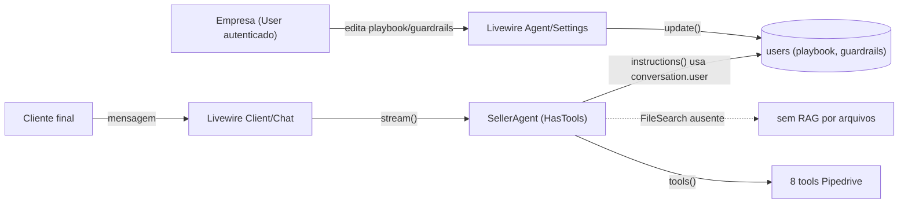
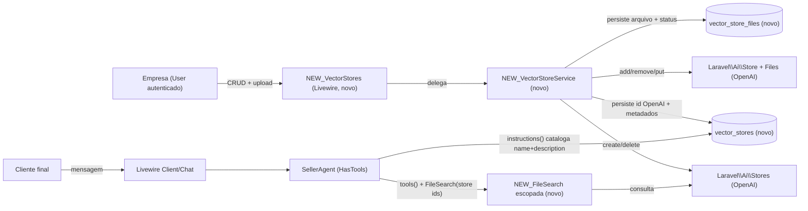

# SPEC: company-vector-stores

## Metadata
- Source: developer description via /plan
- Service: lab-agent-seller (Laravel 13 + Livewire 4 monolith, single repo)
- Tier: standard
- Version: 1.1
- Architecture references: AGENTS.md, docs/agents/architecture.md, docs/agents/domain_rules.md, docs/agents/data_model.md, docs/agents/coding_guidelines.md, docs/agents/api_contracts.md

## Context

Cada empresa (tenant = linha em `users`; "por empresa" = por `User`) precisa fornecer conhecimento próprio ao `SellerAgent` (`app/Ai/Agents/SellerAgent.php`) via RAG. Hoje o agente responde só com o system prompt global, o playbook/guardrails da empresa (`app/Livewire/Agent/Settings.php`) e as 8 tools Pipedrive; a única tool nativa de provider referenciada no código é `WebSearch` (import em `SellerAgent.php:23`), e a tool nativa irmã `FileSearch` (`Laravel\Ai\Providers\Tools\FileSearch`, verified at vendor/laravel/ai/src/Providers/Tools/FileSearch.php:23) ainda não é injetada.

Esta feature adiciona: (a) uma UI Livewire de gestão (CRUD de vector stores + upload/remoção de arquivos) para a empresa autenticada; (b) integração com OpenAI Vector Stores + Files API através do `laravel/ai` v0 (`Laravel\Ai\Stores` — create/get/delete, verified at vendor/laravel/ai/src/Stores.php; `Laravel\Ai\Store` — add/remove/delete/refresh, verified at vendor/laravel/ai/src/Store.php; `Laravel\Ai\Files` — put/delete, verified at vendor/laravel/ai/src/Files.php); (c) o wiring da tool nativa `FileSearch` no `SellerAgent`, escopada aos ids de vector store da empresa da conversa. O provider OpenAI já implementa `StoreProvider` e `SupportsFileSearch` (verified at vendor/laravel/ai/src/Providers/OpenAiProvider.php:23), portanto não há mudança de dependência.

A empresa da conversa é resolvida por `Conversation.user_id` (`SellerAgent::instructions()` já usa `$this->conversation->user`, verified at app/Ai/Agents/SellerAgent.php:123).

### Regras de arquitetura herdadas (fonte: docs)
- **Fat service / thin component** (`coding_guidelines.md` §5): a lógica de negócio (chamadas OpenAI, orquestração de rollback, persistência) vive em `app/Services`; o componente Livewire apenas valida, autoriza e delega — como `Connect::connect` delega a `CrmDriverManager`/`match`.
- **Todas as páginas são Livewire** (`AGENTS.md` §2, `api_contracts.md`): não há `routes/api.php`; a gestão é um componente Livewire sob `app/Livewire/`, não um controller REST.
- **Isolamento multi-tenant por `User`** (`domain_rules.md`): toda leitura/escrita é escopada à empresa autenticada, como `Agent\Settings` que só lê/grava `auth()->user()`.
- **Categóricos são lookup tables slug-keyed** (`coding_guidelines.md` §4, `data_model.md`): status (ex.: status de indexação de arquivo) segue o padrão `Concerns\IsLookup`, não enum PHP nem coluna enum.
- **Strings PT-BR** (`coding_guidelines.md` §7): todo texto de UI/erro em português; identificadores em inglês.
- **Sem soft deletes no MVP** (`database-schema.md`): a exclusão é física.

## AS IS — Estado atual

Legenda: hoje a empresa só configura playbook e guardrails em `Agent/Settings`; o `SellerAgent` expõe as 8 tools Pipedrive e não possui a tool `FileSearch` nem qualquer base documental própria da empresa (verificado em app/Ai/Agents/SellerAgent.php:142).

## TO BE — Estado proposto

Legenda: `NEW_VectorStores` (UI-01..UI-04) delega a `NEW_VectorStoreService` (RF-01..RF-06, RF-08, CT-03), que cria/apaga stores e arquivos na OpenAI e persiste os ids OpenAI localmente em `vector_stores`/`vector_store_files` (novo). O `SellerAgent` ganha a tool `NEW_FileSearch` escopada aos ids da empresa (RF-09/RF-10, CT-01) e `instructions()` passa a catalogar nome+descrição de cada store (RF-11). Nós marcados `?` inexistem hoje e são criados por esta feature.

## Scope
- **In**: componente Livewire de gestão CRUD de vector stores da empresa autenticada; criação/edição (nome + descrição obrigatórios), listagem escopada, exclusão; upload direto de arquivo (multipart → OpenAI Files API → anexo ao vector store) e remoção de arquivo; visibilidade do status de indexação; persistência do id OpenAI do vector store e do id OpenAI de cada arquivo; wiring da tool nativa `FileSearch` no `SellerAgent` escopada aos ids da empresa da conversa; injeção do catálogo (nome + descrição) dos stores nas instruções do agente.
- **Out**: administração de stores por qualquer usuário que não seja a empresa dona; compartilhamento de stores entre empresas; ingestão de arquivos por URL, conector ou sincronização de nuvem (só upload direto); reprocessamento/re-chunking manual; versionamento de arquivos; tools além de `FileSearch`; alterar a resolução de empresa (segue por `Conversation.user_id`); acesso do cliente final à gestão de stores.

## RIGID (Non-Negotiable)

### Functional Requirements

- RF-01 [Event-Driven] QUANDO a empresa autenticada submete a criação de um vector store com `nome` e `descrição` preenchidos, o sistema DEVE criar um vector store correspondente na OpenAI e persistir localmente o registro vinculado à empresa somente após obter o id OpenAI retornado.
  - AC: após criação bem-sucedida existe exatamente 1 registro local vinculado ao `User` autenticado contendo o id OpenAI não-nulo retornado pela OpenAI, e o vector store existe na OpenAI.
- RF-02 [Unwanted] SE a criação do vector store na OpenAI falhar (exceção ou ausência de id), ENTÃO o sistema NÃO DEVE deixar nenhum registro local persistido para essa tentativa e DEVE exibir mensagem de erro em PT-BR.
  - AC: após uma falha simulada na OpenAI, a contagem de `vector_stores` da empresa é idêntica à de antes da tentativa (nenhum órfão) e uma mensagem de erro é exibida.
- RF-03 [State-Driven] ENQUANTO a empresa autenticada acessa a gestão de vector stores, o sistema DEVE listar apenas os vector stores cujo dono é o próprio `User` autenticado.
  - AC: dado dois `User` A e B com stores, ao listar como A nenhum store de B aparece; a query é filtrada por `user_id` do autenticado.
- RF-04 [Event-Driven] QUANDO a empresa autenticada edita `nome` e/ou `descrição` de um store que lhe pertence, o sistema DEVE persistir os novos valores APENAS localmente, mantendo o mesmo id OpenAI, SEM realizar qualquer chamada à OpenAI. Justificativa (RIGID): o facade `Laravel\Ai\Stores` expõe somente `create`/`get`/`delete` (não há `update`) e `Laravel\Ai\Store` sequer expõe `description`; nome+descrição são um catálogo local usado para montar o contexto da tool do `SellerAgent` (`instructions()` / rotulagem do FileSearch).
  - AC: após editar, o registro local reflete os novos nome/descrição, o id OpenAI permanece inalterado e nenhuma chamada à OpenAI é feita (a operação não pode falhar remotamente).
- RF-05 [Event-Driven] QUANDO a empresa autenticada exclui um store que lhe pertence, o sistema DEVE, NESTA ORDEM: (1) para cada documento rastreado do store, chamar `Store::remove($documentId, deleteFile: true)` (remove o documento do store E apaga o File subjacente, pois `Stores::delete()`/`Store::delete()` apagam apenas o vector store e deixam os File objects órfãos na OpenAI); (2) apagar o vector store na OpenAI; (3) remover o registro local do store e os registros de arquivo associados. Cada passo remoto segue a regra de resiliência da RNF-05 (PRESERVE + idempotente-404).
  - AC: após exclusão bem-sucedida, o vector store e todos os seus File objects não existem mais na OpenAI e não há registro local do store nem de seus arquivos para a empresa; se algum passo remoto falhar de verdade (5xx/rede/timeout), o registro local é preservado e um erro PT-BR é exibido.
- RF-06 [Event-Driven] QUANDO a empresa autenticada faz upload de um arquivo para um store que lhe pertence, o sistema DEVE chamar `Store::add(UploadedFile)` (que envia à Files API e anexa ao vector store) e persistir AMBOS os identificadores retornados por `AddedDocumentResponse`: `id` (id do documento no vector store → `openai_document_id`) e `fileId` (id do File object → `openai_file_id`), vinculados ao store. O `openai_document_id` é o `$documentId` exigido na remoção (RF-08).
  - AC: após upload bem-sucedido, existe 1 registro de arquivo com `openai_document_id` e `openai_file_id` não-nulos vinculado ao store, o arquivo está anexado ao vector store OpenAI correspondente, e o registro é escopado à empresa dona do store.
- RF-07 [State-Driven] ENQUANTO um store tiver arquivos anexados, o sistema DEVE tornar visível na UI o estado AGREGADO de indexação do store, derivado de `StoreFileCounts{completed, pending, failed}` + `Store->ready` (o SDK `laravel/ai` NÃO expõe status por arquivo — apenas contadores em nível de store, verified at vendor/laravel/ai/src/Store.php e Responses/Data/StoreFileCounts.php). A linha de cada arquivo herda o estado "em processamento" até o store reportar `ready`.
  - AC: a UI exibe o estado agregado do store (em processamento / pronto / N com falha) derivado de `fileCounts`/`ready`; o estado muda para "pronto" quando a OpenAI reporta `ready` (pending == 0). Não há afirmação de status individual por arquivo além da herança do agregado.
- RF-08 [Event-Driven] QUANDO a empresa autenticada remove um arquivo de um store que lhe pertence, o sistema DEVE chamar `Store::remove($documentId, deleteFile: true)` (usando o `openai_document_id` persistido), removendo o documento do vector store E apagando o File object subjacente na OpenAI (sem File/armazenamento órfão), e só então apagar o registro local do arquivo. A operação segue a RNF-05 (PRESERVE + idempotente-404).
  - AC: após remoção bem-sucedida, o documento não está mais anexado ao vector store OpenAI, o File object subjacente foi apagado e não há registro local do arquivo; um 404/"já removido" da OpenAI é tratado como sucesso idempotente; uma falha real preserva o registro local e exibe erro PT-BR.
- RF-09 [Conditional] SE a empresa da conversa (resolvida por `Conversation.user_id`) possui ao menos um vector store com id OpenAI, ENTÃO `SellerAgent::tools()` DEVE incluir a tool nativa `FileSearch` escopada exatamente aos ids OpenAI de vector store dessa empresa.
  - AC: para uma empresa com N (>0) stores, `tools()` inclui uma instância de `Laravel\Ai\Providers\Tools\FileSearch` cujo `ids()` é exatamente o conjunto dos N ids OpenAI da empresa, e nenhum id de outra empresa.
- RF-10 [Unwanted] SE a empresa da conversa não possui nenhum vector store, ENTÃO `SellerAgent::tools()` NÃO DEVE incluir a tool `FileSearch`.
  - AC: para uma empresa sem stores, nenhuma instância de `FileSearch` está presente em `tools()` (as demais tools permanecem inalteradas).
- RF-11 [State-Driven] ENQUANTO o `SellerAgent` monta suas instruções para uma conversa, o sistema DEVE incluir o catálogo de nome + descrição de cada vector store da empresa, de modo que o agente saiba o que cada store contém.
  - AC: as instruções renderizadas para uma empresa com stores contêm o nome e a descrição de cada um de seus stores; para uma empresa sem stores nenhum catálogo é adicionado.

### UI Requirements

- UI-01 [State-Driven] ENQUANTO a empresa autenticada acessa a tela de gestão, a UI DEVE exibir a lista dos seus vector stores com nome, descrição e ações de editar e excluir; sem stores, DEVE exibir um empty-state em PT-BR.
  - AC: com ≥1 store a lista mostra cada store com ações editar/excluir; com 0 stores mostra o empty-state; nenhum store de outra empresa é exibido.
- UI-02 [Event-Driven] QUANDO a empresa submete o formulário de criação/edição sem `nome` ou sem `descrição`, a UI DEVE bloquear o envio e exibir erro de validação em PT-BR para o campo faltante.
  - AC: submeter com nome ou descrição vazios não cria/edita store e mostra a mensagem de validação PT-BR do campo faltante.
- UI-03 [State-Driven] ENQUANTO um store está aberto na gestão, a UI DEVE oferecer um controle de upload de arquivo e listar os arquivos do store com seu status de indexação e ação de remover.
  - AC: a lista de arquivos exibe, por arquivo, nome, status de indexação e botão remover; o controle de upload aceita um arquivo por vez.
- UI-04 [Unwanted] SE uma operação de store/arquivo contra a OpenAI falhar, ENTÃO a UI DEVE exibir uma mensagem de erro amigável em PT-BR sem expor detalhes técnicos internos, preservando o estado consistente da tela.
  - AC: uma falha simulada da OpenAI resulta em banner/erro PT-BR sem stack trace/nomes internos, e a lista permanece consistente com o estado persistido.

### Contracts

- CT-01: Tool do agente — `SellerAgent::tools()` (app/Ai/Agents/SellerAgent.php:142) passa a incluir `new \Laravel\Ai\Providers\Tools\FileSearch($storeIds)` quando a empresa da conversa (`$this->conversation->user`) tiver stores; `$storeIds` = ids OpenAI de vector store da empresa. Contrato do construtor: `FileSearch(array $stores, Closure|array|null $where = null)` (verified at vendor/laravel/ai/src/Providers/Tools/FileSearch.php:23).
- CT-02: Rotas Livewire (novas) sob o guard `auth` (painel da empresa), seguindo `routes/web.php` existente. Rota(s) de gestão de vector stores como componente(s) Livewire; nomes/paths concretos definidos no planejamento (novo — não congelados aqui pois inexistem no código).
- CT-03: SDK `laravel/ai` v0 (provider OpenAI, verified at vendor/laravel/ai/src/Providers/OpenAiProvider.php:23):
  - Criar store: `Laravel\Ai\Stores::create(string $name, ?string $description, ...): Store` (verified at vendor/laravel/ai/src/Stores.php:24).
  - Apagar store: `Laravel\Ai\Stores::delete(string $storeId): bool` / `Store::delete()` (verified at vendor/laravel/ai/src/Stores.php:37, src/Store.php).
  - Upload + anexar: `Store::add(UploadedFile|string|... $file, array $metadata = []): AddedDocumentResponse` (aceita `UploadedFile` multipart diretamente, verified at vendor/laravel/ai/src/Store.php:29). `AddedDocumentResponse` expõe `id` (id do documento no vector store) E `fileId` (id do File object); RF-06 persiste ambos.
  - Remover arquivo: `Store::remove(string $documentId, bool $deleteFile = false): bool` (verified at vendor/laravel/ai/src/Store.php:69). RF-05/RF-08 SEMPRE chamam com `deleteFile: true` para apagar também o File object subjacente (sem órfão). `$documentId` = `openai_document_id` persistido.
  - Apagar store não remove Files: `Stores::delete()`/`Store::delete()` apagam apenas o vector store, deixando os File objects órfãos na OpenAI — por isso RF-05 itera `remove(..., deleteFile: true)` antes de apagar o store.
  - Status/contadores: `Store::refresh(): Store`, `Store->ready`, `Store->fileCounts` (verified at vendor/laravel/ai/src/Store.php:83 e construtor).

### Non-Functional Requirements

- RNF-01 [Segurança/Isolamento]: toda operação de leitura/escrita de store e arquivo DEVE ser autorizada contra `auth()->user()->id == vector_store.user_id`; uma tentativa de operar sobre um store de outra empresa DEVE retornar 403/abort e não alterar dado algum. (Espelha o padrão `abort_unless` de `CompanySelection::select`, `domain_rules.md`.)
- RNF-02 [Atomicidade]: a criação NÃO DEVE persistir registro local antes de confirmar o id OpenAI (sem órfão local); a persistência local ocorre somente após retorno bem-sucedido da OpenAI (reforça RF-01/RF-02).
- RNF-03 [Validação de upload]: o upload DEVE validar tipo e tamanho do arquivo antes de enviar à OpenAI. Tipo: aceitar SOMENTE os tipos suportados para indexação pelo File Search da OpenAI (o conjunto de documentos suportados pelo provider é a fonte de verdade — não uma whitelist arbitrária de produto); qualquer tipo fora desse conjunto DEVE ser rejeitado com mensagem PT-BR. Tamanho: cap de 512 MB por arquivo (teto da OpenAI Files API); acima disso, rejeitar com mensagem PT-BR.
- RNF-04 [i18n]: todas as strings de UI e mensagens de erro DEVEM estar em PT-BR (`coding_guidelines.md` §7).
- RNF-05 [Resiliência de exclusão remota — PRESERVE + idempotente-404]: em cada passo remoto de exclusão de store (RF-05) ou remoção de arquivo (RF-08): (a) se a OpenAI retornar 404/"já removido", tratar como SUCESSO idempotente e apagar o registro local correspondente; (b) se ocorrer falha real (5xx/rede/timeout), PRESERVAR o registro local intacto, exibir erro PT-BR e permitir retry manual. O registro local NUNCA é removido sem confirmação remota (ou not-found confirmado). Não há job de reconciliação de órfãos.
- RNF-06 [Infra — limite de upload de 512 MB]: como o cap de 512 MB (RNF-03) excede os limites padrão de PHP/Livewire, o plano DEVE garantir que a stack aceite arquivos de 512 MB: `upload_max_filesize` e `post_max_size` (PHP), o limite de temporary-upload do Livewire, e `client_max_body_size` de qualquer Sail/nginx à frente. Sem esses ajustes o upload falha antes de chegar à validação da aplicação.

## FLEXIBLE (Implementation Suggestions)

- Persistência (novo, sem soft delete — `database-schema.md`):
  - `vector_stores`: `id`, `user_id` (FK cascade, escopo tenant), `openai_vector_store_id` (string, id retornado pela OpenAI), `name`, `description`, timestamps. Índice/uniqueness sugerido em `openai_vector_store_id`.
  - `vector_store_files`: `id`, `vector_store_id` (FK cascade), `openai_file_id` (string), `filename`, referência de status de indexação, timestamps.
  - Status de indexação como lookup slug-keyed (`Concerns\IsLookup`, seed via `LookupSeeder`) — ex.: `file_indexing_statuses` com slugs `pending`, `in_progress`, `completed`, `failed` — coerente com `scan_statuses`/§4 dos guidelines.
- Serviço `App\Services\Ai\VectorStoreService` (ou similar) concentra chamadas a `Stores`/`Store`/`Files`, o rollback de criação e o mapeamento de status; o componente Livewire (`App\Livewire\Agent\VectorStores`) só valida/autoriza/delega (padrão fat service / thin component).
- Reaproveitar componentes de design existentes (`x-card`, `x-badge` para status de indexação, `x-empty-state`, `x-alert`, `x-input`/upload) já previstos no design system (Phase 3).
- Upload: `Store::add()` aceita `Illuminate\Http\UploadedFile` direto (Livewire `WithFileUploads`), evitando conversão manual para a Files API.
- Escopo da tool: derivar `$storeIds` de `$this->conversation->user->vectorStores()->pluck('openai_vector_store_id')`; catálogo do RF-11 injetado como bloco textual em `instructions()` ao lado do playbook.
- Atualização de status de indexação via polling Livewire (padrão já usado no `ScanCard`) chamando `Store::refresh()`/`fileCounts`.

## Acceptance Criteria Summary
| ID | Criterion | Testable? |
|----|-----------|-----------|
| RF-01 | Criar store cria na OpenAI e persiste id retornado, vinculado ao User | Sim |
| RF-02 | Falha na OpenAI não deixa registro órfão + erro PT-BR | Sim |
| RF-03 | Listagem só retorna stores do User autenticado | Sim |
| RF-04 | Editar nome/descrição é local-only, mantém id OpenAI, sem chamada OpenAI | Sim |
| RF-05 | Excluir itera remove(deleteFile:true) → apaga store → registros locais | Sim |
| RF-06 | Upload persiste openai_document_id + openai_file_id, anexa ao store | Sim |
| RF-07 | Estado agregado de indexação do store (fileCounts/ready) visível | Sim |
| RF-08 | Remover arquivo usa remove(deleteFile:true) e apaga registro local | Sim |
| RF-09 | tools() inclui FileSearch com exatamente os ids da empresa | Sim |
| RF-10 | Sem stores → FileSearch ausente | Sim |
| RF-11 | instructions() cataloga name+description dos stores | Sim |
| UI-01 | Lista com ações + empty-state, escopada | Sim |
| UI-02 | Validação nome+descrição obrigatórios (PT-BR) | Sim |
| UI-03 | Controle de upload + lista de arquivos com status e remover | Sim |
| UI-04 | Erro OpenAI vira mensagem PT-BR sem detalhe técnico | Sim |
| RNF-01 | 403 ao operar store de outra empresa | Sim |
| RNF-02 | Sem persistência local antes do id OpenAI | Sim |
| RNF-03 | Validação: tipos File Search OpenAI + cap 512 MB (PT-BR) | Sim |
| RNF-04 | Strings PT-BR | Sim |
| RNF-05 | Exclusão remota: PRESERVE + idempotente-404 | Sim |
| RNF-06 | Infra aceita upload de 512 MB (PHP/Livewire/nginx) | Sim |
</content>
</invoke>
