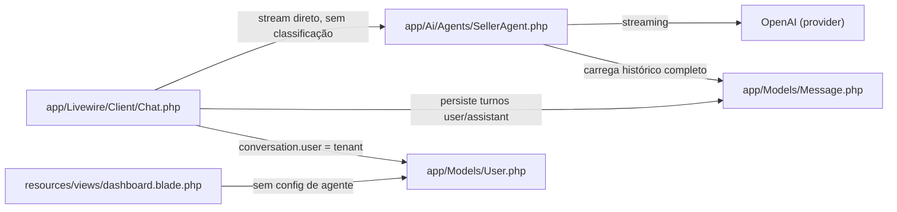
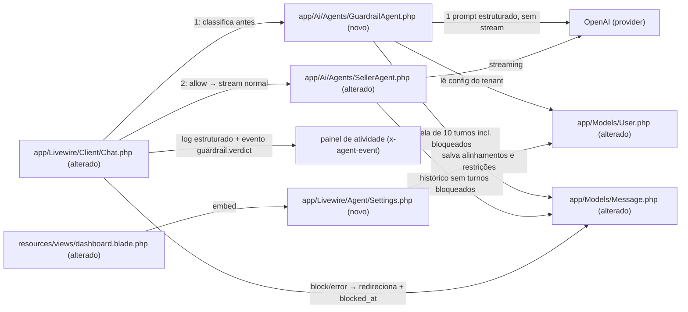

# Implementation Plan

## Request Summary
- Objective: Adicionar camada de guardrail — um Agent `laravel/ai` que classifica cada mensagem inbound do cliente (mensagem atual + janela de 10 turnos) ANTES do `SellerAgent`, com veredito fechado allow/block (+ 6 categorias), fail-closed em falha, configuração por empresa (2 textareas no painel admin), marcação de mensagens bloqueadas e observabilidade (log estruturado + evento `guardrail.verdict` no painel de atividade).
- Scope in: GuardrailAgent, orquestração no `Chat::generateResponse`, flag de bloqueio em `messages`, 2 colunas de config em `users`, UI admin Livewire, exclusão de turnos bloqueados do histórico do SellerAgent, testes de feature.
- Scope out: guardrail de saída, alteração de system prompt/tools do SellerAgent, dados de CRM no contexto, rate limiting, dashboard de vereditos, outros providers.
- Tier: standard
- Architecture references: AGENTS.md, docs/agents/architecture.md, docs/agents/domain_rules.md

## AS IS — Componentes impactados

Fluxo atual verificado: `Chat::sendMessage` persiste o turno user (Chat.php:114) e `Chat::generateResponse` invoca o SellerAgent em streaming (Chat.php:156) sem nenhuma classificação prévia; `messages` não tem marcador de bloqueio e `users` não tem campos de configuração de guardrail. O dashboard só exibe cards de CRM.

## TO BE — Componentes propostos

O `GuardrailAgent (novo)` nasce em T03; `Message (alterado)` ganha `blocked_at` em T01; `User (alterado)` ganha as colunas de config em T02; `SellerAgent (alterado)` passa a filtrar turnos bloqueados em T04; o `Chat (alterado)` orquestra veredito, bloqueio e fail-closed em T05 e a observabilidade em T06; `Settings (novo)` e o embed no dashboard nascem em T07. Testes cobrem tudo em T08–T10.

## Tasks

### T01 — Marcador de bloqueio em `messages`
- **Files**: `database/migrations/2026_07_12_000001_add_blocked_at_to_messages_table.php` (novo), `app/Models/Message.php`, `database/factories/MessageFactory.php`
- **Change**: Migration aditiva `$table->timestamp('blocked_at')->nullable()` em `messages` (com `down()` que remove a coluna). No model `Message`: adicionar `blocked_at` ao `#[Fillable]`, cast `datetime` e PHPDoc `@property Carbon|null $blocked_at`. Na factory, state `blocked()` que preenche `blocked_at`. Nenhuma lookup table: bloqueio é flag temporal, não valor categórico (convenção AGENTS.md seção 2 preservada — a categoria do veredito NÃO é persistida em banco nesta fase, apenas em log, conforme FLEXIBLE do SPEC).
- **Covers**: RF-03 (marcação), RF-08 (marcação no fail-closed)
- **Tests**: `tests/Feature/GuardrailTest.php` (T08) — asserções de `blocked_at` preenchido no turno bloqueado; factory state usada nos cenários de exclusão de histórico.
- **Risk**: Low — coluna nullable aditiva, sem backfill.
- **Dependencies**: none

### T02 — Configuração de guardrail por empresa em `users`
- **Files**: `database/migrations/2026_07_12_000002_add_guardrail_settings_to_users_table.php` (novo), `app/Models/User.php`
- **Change**: Migration aditiva com `$table->text('guardrail_topic_alignments')->nullable()` e `$table->text('guardrail_restrictions')->nullable()` em `users` (com `down()`). No model `User`: adicionar as 2 colunas ao `#[Fillable]` e PHPDoc `@property string|null`. Campos livres por tenant (empresa = `users`, docs/agents/domain_rules.md), vazio = filtro correspondente inativo (RF-05).
- **Covers**: UI-01, UI-02 (persistência), RF-05, RNF-01
- **Tests**: `tests/Feature/AgentSettingsTest.php` (T09) — persistência e isolamento por empresa; `tests/Feature/GuardrailTest.php` (T08) — injeção da config no prompt.
- **Risk**: Low — colunas nullable aditivas em tabela de auth; nenhum fluxo existente lê os campos.
- **Dependencies**: none

### T03 — `GuardrailAgent` com saída estruturada (CT-01)
- **Files**: `app/Ai/Agents/GuardrailAgent.php` (novo)
- **Change**: Novo agente ao lado do `SellerAgent`, seguindo o padrão do diretório (`docs/agents/architecture.md` directory layout): `#[Provider(Lab::OpenAI)]`, `#[Model('gpt-5.6-terra')]` (mesmo modelo do SellerAgent — assumption), `use Promptable`, implements `Agent`, `Conversational`, `HasStructuredOutput`, `HasProviderOptions` (`reasoning.effort = low`). NÃO implementa `HasTools` (0 tools, 0 fan-out — RNF-02). Componentes:
  - `__construct(public Conversation $conversation, public ?int $historyBeforeMessageId = null)` — espelha o SellerAgent.
  - `schema(JsonSchema $schema)`: mapeia CT-01 com tipos concretos — `verdict` string enum `['allow','block']` obrigatório; `category` string enum das 6 categorias (`prompt_injection`, `jailbreak`, `intent_change`, `pii`, `off_topic`, `company_restriction`), nullable/obrigatória quando block. Sem `object`/`any` genéricos.
  - `instructions()`: prompt de classificação em PT-BR contendo instruções explícitas e nomeadas para os 6 critérios (RF-06), incluindo: distinção PII de terceiros/dados internos (bloqueia) vs. cliente informando os PRÓPRIOS dados de contato para compra (permite); `intent_change` = redefinição de papel/persona, ativa sempre; `off_topic` = exclusivamente assunto fora dos alinhamentos, sem sobreposição com `intent_change`. Injeta `conversation->user->guardrail_topic_alignments` e `->guardrail_restrictions` (RNF-01 — exclusivamente a empresa dona da conversa). Os 6 critérios são SEMPRE nomeados no prompt (AC de RF-06 exige inspeção encontrar os 6); quando alinhamentos estiverem vazios, a seção `off_topic` instrui explicitamente "não aplicável — nunca use esta categoria" (idem para restrições/`company_restriction`), satisfazendo RF-05 sem violar RF-06.
  - `messages()`: janela das últimas 10 mensagens com `id <` do turno atual (desc limit 10, revertidas para ordem cronológica), INCLUINDO turnos com `blocked_at` (RF-01) — comportamento oposto ao filtro do SellerAgent (T04); dono do contexto é o agente (layer responsibilities, docs/agents/architecture.md).
- **Covers**: RF-01 (janela), RF-02, RF-05, RF-06, RNF-01, RNF-02, CT-01
- **Tests**: `tests/Feature/GuardrailTest.php` (T08) — `assertPrompted` inspecionando instructions (6 critérios, config injetada, desativação condicional) e janela ≤ 10 mensagens incluindo bloqueadas.
- **Risk**: Medium — qualidade do prompt de classificação define falsos positivos/negativos; estrutura é testável, comportamento do modelo real não (fakes nos testes).
- **Dependencies**: T02

### T04 — SellerAgent exclui turnos bloqueados do histórico
- **Files**: `app/Ai/Agents/SellerAgent.php`
- **Change**: Em `messages()` (SellerAgent.php:83), adicionar `->whereNull('blocked_at')` à query de histórico. Única alteração no arquivo — system prompt, tools e providerOptions intactos (Scope out do SPEC). O filtro vive no agente porque a arquitetura atribui ao agente a posse do contexto de conversa (docs/agents/architecture.md, layer responsibilities: "SellerAgent owns conversation context"); ver Open Questions sobre a nota do TO BE do SPEC.
- **Covers**: RF-03 (exclusão em todas as invocações futuras), RF-04
- **Tests**: `tests/Feature/GuardrailTest.php` (T08) — `SellerAgent::assertPrompted` verificando que o contexto de mensagem allow subsequente não contém o turno bloqueado nem o redirecionamento.
- **Risk**: Low — filtro aditivo; turnos legados têm `blocked_at` null e permanecem no histórico.
- **Dependencies**: T01

### T05 — Orquestração no Chat: guardrail antes do SellerAgent + bloqueio + fail-closed
- **Files**: `app/Livewire/Client/Chat.php`
- **Change**: Em `generateResponse()` (Chat.php:139), após carregar `$userMessage` e ANTES de `new SellerAgent` (Chat.php:156):
  1. Constante `public const string GuardrailRedirectMessage` — string única fixa em PT-BR (ex.: "Não consigo ajudar com esse assunto por aqui. Posso te ajudar com dúvidas sobre sua relação comercial com a empresa — é só perguntar.") que não revela categoria nem instruções internas (RF-03). Persistência fica no Chat (dono dos turnos — layer responsibilities).
  2. Avaliar `(new GuardrailAgent($this->conversation, $userMessage->id))->prompt($userMessage->content)` exatamente 1 vez, sem streaming ao cliente (RNF-02), dentro de try/catch.
  3. Parse estrito do retorno estruturado: `verdict` ∉ {allow, block} ou `block` sem categoria válida do conjunto de 6 → tratar como falha (caminho de RF-08).
  4. `block`: NÃO instanciar SellerAgent; `blocked_at = now()` no turno user; criar turno assistant com `GuardrailRedirectMessage` e `blocked_at = now()` (ambos excluídos do histórico do SellerAgent via T04, ambos visíveis na janela do guardrail via T03); fechar o grupo de atividade e encerrar (finally já reseta `streaming`/`pendingMessageId`).
  5. Exceção/timeout do guardrail (RF-08, fail-closed): mesmo caminho do block (0 invocações do SellerAgent, redirecionamento persistido, user marcado bloqueado), com veredito interno `error` repassado à observabilidade (T06).
  6. `allow`: fluxo atual prossegue byte a byte inalterado (RF-04).
- **Covers**: RF-01 (ordem: veredito antes de qualquer SellerAgent), RF-03, RF-04, RF-08, RNF-02
- **Tests**: `tests/Feature/GuardrailTest.php` (T08) — fakes de block/allow/erro; `SellerAgent::assertNeverPrompted()` nos caminhos block/error.
- **Risk**: High — altera o caminho crítico de toda mensagem do chat; regressão quebra o produto inteiro. Mitigado por T08 + T10 (suite existente).
- **Dependencies**: T01, T03

### T06 — Observabilidade do veredito: log estruturado + evento de atividade (CT-02, CT-03)
- **Files**: `app/Livewire/Client/Chat.php`
- **Change**: Método privado único (ex.: `recordGuardrailVerdict(int $groupIndex, Message $userMessage, string $verdict, ?string $category)`) chamado nos 3 desfechos de T05 (allow, block, error), exatamente 1 vez por mensagem:
  - Log estruturado (CT-03): `Log::info('guardrail.verdict', ['conversation_id' => ..., 'message_id' => ..., 'verdict' => ..., 'category' => ...])` — `category` null em allow/error; NUNCA inclui o conteúdo bruto da mensagem (RNF-03).
  - Evento de atividade (CT-02): `pushActivityEvent($groupIndex, 'guardrail.verdict', 
, ['verdict' => ..., 'category' => ...])` no grupo "RESPOSTA #N" corrente, reutilizando o pipeline existente (Chat.php:321) e o componente polimórfico `x-agent-event` sem alteração (tom visual warn/danger é FLEXIBLE — fora do mínimo).
- **Covers**: RF-07, RF-08 (evento/log do erro), CT-02, CT-03, RNF-03
- **Tests**: `tests/Feature/GuardrailTest.php` (T08) — `Log::spy()`/`Log::shouldReceive` validando os 4 campos e ausência do conteúdo da mensagem; asserção do evento `guardrail.verdict` no estado `activity` do componente.
- **Risk**: Low — código aditivo; mesmo arquivo de T05, executar em sequência.
- **Dependencies**: T05

### T07 — UI admin: componente Livewire `Agent\Settings` no dashboard
- **Files**: `app/Livewire/Agent/Settings.php` (novo), `resources/views/livewire/agent/settings.blade.php` (novo), `resources/views/dashboard.blade.php`
- **Change**: Novo componente Livewire (convenção AGENTS.md seção 2: toda página/seção de UI é Livewire; namespace novo `Agent/` ao lado de `Auth/`, `Client/`, `Crm/`), embutido no dashboard existente via `<livewire:agent.settings />` (rota `/dashboard`, guard `auth` — verified routes/web.php:30). Comportamento:
  - `mount()`: carrega `guardrail_topic_alignments` e `guardrail_restrictions` do `Auth::user()` (somente a própria empresa — UI-01/UI-02 isolamento).
  - Dois textareas rotulados ("Alinhamentos de assunto" e "Restrições específicas da empresa"), validação `['nullable', 'string']` (UI-03: vazio salva sem erro), botão salvar com feedback de sucesso.
  - Persistência via update no próprio user autenticado; reexibição preenchida no próximo acesso.
  - Visual: seguir design system existente (`x-card`, `x-button`; textarea estilizada com os mesmos tokens de `x-input` — verificar se `x-input` suporta multiline antes de criar markup próprio [UNVERIFIED]).
- **Covers**: UI-01, UI-02, UI-03
- **Tests**: `tests/Feature/AgentSettingsTest.php` (T09).
- **Risk**: Low — página nova isolada; único toque em arquivo compartilhado é 1 linha no dashboard.blade.php.
- **Dependencies**: T02

### T08 — Testes de feature do fluxo guardrail (`GuardrailTest`)
- **Files**: `tests/Feature/GuardrailTest.php` (novo)
- **Change**: Suite Pest seguindo o padrão de `tests/Feature/ChatTest.php` (helpers `companyMatchingEmail`, `Livewire::actingAs(..., 'client')`, `GuardrailAgent::fake([['verdict' => ..., 'category' => ...]])` — arrays viram `StructuredTextResponse`, verified vendor/laravel/ai/src/Gateway/FakeTextGateway.php:183 — e `SellerAgent::fake()`/`assertNeverPrompted`). Casos mínimos:
  - `guardrail_runs_once_before_seller_with_capped_history_window` — 1 avaliação por mensagem, janela ≤ 10 incluindo turnos bloqueados, veredito antes de qualquer SellerAgent (RF-01, RNF-02: 2 chamadas em allow, 1 em block).
  - `block_skips_seller_and_persists_fixed_redirect` — `SellerAgent::assertNeverPrompted()`, turno assistant = `Chat::GuardrailRedirectMessage`, turno user com `blocked_at`, texto sem categoria/instruções internas (RF-02, RF-03).
  - `blocked_turns_are_excluded_from_seller_history` — mensagem allow subsequente: contexto do SellerAgent sem o turno bloqueado nem o redirecionamento (RF-03/T04).
  - `allow_streams_seller_normally` — SellerAgent invocado 1 vez, assistant = resposta do Seller (RF-04).
  - `company_config_is_injected_and_empty_fields_disable_matching_filters` — `GuardrailAgent::assertPrompted` com textos configurados; instructions com campos vazios marcam off_topic/company_restriction como não aplicáveis; 2 empresas com configs distintas → cada prompt só contém a própria config (RF-05, RNF-01).
  - `guardrail_instructions_name_all_six_criteria` — inspeção programática das instructions: 6 critérios nomeados + distinção PII própria vs terceiros (RF-06).
  - `verdict_is_logged_and_emitted_as_activity_event` — 1 log com os 4 campos de CT-03 e 1 evento `guardrail.verdict` (CT-02) por mensagem, em allow e block; log sem o conteúdo bruto (RF-07, RNF-03).
  - `guardrail_failure_fails_closed` — fake lançando exceção: 0 SellerAgent, redirecionamento persistido, user bloqueado, log `verdict=error`/`category` null, evento de atividade (RF-08).
- **Covers**: ACs de RF-01..RF-08, RNF-01..RNF-03
- **Tests**: o próprio arquivo; rodar `vendor/bin/sail artisan test --compact --filter=Guardrail`.
- **Risk**: Low.
- **Dependencies**: T03, T04, T05, T06

### T09 — Testes de feature da UI admin (`AgentSettingsTest`)
- **Files**: `tests/Feature/AgentSettingsTest.php` (novo)
- **Change**: Suite Pest com `Livewire::actingAs($company)` (guard `auth`): salvar e recarregar preserva os 2 campos (UI-01, UI-02); empresa B não vê nem afeta valores da empresa A (isolamento); salvar com ambos vazios não gera erro de validação (UI-03); dashboard renderiza o componente para empresa autenticada.
- **Covers**: ACs de UI-01, UI-02, UI-03
- **Tests**: o próprio arquivo.
- **Risk**: Low.
- **Dependencies**: T07

### T10 — Atualizar suite existente para o novo fluxo + gate completo
- **Files**: `tests/Feature/ChatTest.php`
- **Change**: Todo teste existente que chama `generateResponse` (ex.: `client_message_and_agent_reply_are_persisted`, `agent_uses_global_system_prompt`, `streamed_response_is_persisted_on_completion`, `provider_error_shows_friendly_message_and_preserves_client_message`, `switch_company_opens_other_conversation`) passa a fakear também `GuardrailAgent::fake([['verdict' => 'allow', 'category' => null]])` — sem isso a suite invocaria o provider real. Nenhum teste é removido; asserções existentes permanecem (o fluxo allow é inalterado por RF-04). Ao final, rodar o gate `composer test` (lint + phpstan level 7 + Pest) — obrigação de AGENTS.md seção 3.
- **Covers**: RF-04 (não-regressão do fluxo allow)
- **Tests**: `tests/Feature/ChatTest.php` atualizado; gate `composer test`.
- **Risk**: Medium — ver Open Questions: `agent_exposes_web_search_tool` já diverge do código em disco hoje (pré-existente, fora do escopo; não corrigir silenciosamente).
- **Dependencies**: T05

## Execution Phases

| Phase | Tasks | Parallel-safe? |
|-------|-------|----------------|
| 1 — Fundação de dados | T01, T02 | Yes (arquivos disjuntos) |
| 2 — Agentes e UI admin | T03, T04, T07 | Yes (arquivos disjuntos) |
| 3 — Orquestração no Chat | T05, T06 | No (mesmo arquivo `Chat.php`, T06 depende de T05) |
| 4 — Testes e gate | T08, T09, T10 | Yes (arquivos de teste disjuntos) |

## Risks

| Risk | Blast radius | Mitigation | Rollback |
|------|-------------|------------|----------|
| Regressão no caminho crítico do chat (T05 altera `generateResponse` de toda mensagem) | Todo o produto cliente-final | Fluxo allow inalterado por construção (RF-04); T08 + T10 cobrem allow/block/error com fakes antes do merge | Reverter commit de T05/T06; colunas novas são inertes sem o código |
| Fail-closed indisponibiliza o chat se a OpenAI degradar (por design, RF-08) | Todas as conversas de todos os tenants | Observabilidade `verdict=error` (RF-07/CT-03) torna o incidente visível de imediato | Hotfix removendo a chamada do guardrail em `generateResponse` (1 ponto único de inserção) |
| Latência extra por mensagem (1 chamada de modelo antes do stream iniciar) | UX de toda resposta | `reasoning.effort = low`, janela limitada a 10 turnos, saída estruturada mínima (2 campos) | N/A (custo estrutural aceito por RNF-02) |
| Falsos positivos do classificador bloqueando clientes legítimos | Conversas individuais | Definições explícitas por categoria no prompt (RF-06, ex.: PII própria permitida); categorias condicionais desativadas quando config vazia (RF-05) | Empresa esvazia os campos de config (desativa off_topic/company_restriction); ataque-categorias exigem mudança de prompt |
| Saída estruturada fora do contrato CT-01 (modelo retorna valor inesperado) | Mensagem individual | Parse estrito em T05: valor inválido → caminho fail-closed de RF-08 (nunca allow por engano) | N/A |
| Migrations em `users` e `messages` (tabelas centrais) | Baixo — colunas nullable aditivas, sem backfill nem índices | `down()` implementado em ambas | `migrate:rollback` |
| Suite existente quebrar por guardrail não fakeado | CI | T10 atualiza `ChatTest` no mesmo ciclo de T05 | N/A |

## Open Questions

- **SPEC TO BE vs RF-03 (não bloqueante — plano segue a arquitetura)**: a legenda do TO BE do SPEC afirma "o SellerAgent em si não é alterado", mas RF-03 exige excluir turnos bloqueados do histórico enviado ao SellerAgent em todas as invocações futuras — e a arquitetura atribui ao agente a posse do contexto de conversa (docs/agents/architecture.md, layer responsibilities). O plano segue a arquitetura: T04 adiciona 1 filtro `whereNull('blocked_at')` em `SellerAgent::messages()`, sem tocar system prompt/tools (Scope out preservado). Se a intenção era zero alterações no arquivo, a alternativa (filtrar fora do agente) violaria a regra de camadas.
- **Estado pré-existente da suite**: `tests/Feature/ChatTest.php:56` (`agent_exposes_web_search_tool`) espera 1 tool `WebSearch`, mas `SellerAgent::tools()` retorna array vazio no código em disco (divergência já documentada em docs/agents/domain_rules.md; `SellerAgent.php` aparece modificado no git status). O gate `composer test` de T10 pode falhar por essa causa alheia à feature — não corrigir silenciosamente; sinalizar ao usuário na execução.

## Assumptions

- `GuardrailAgent` usa o mesmo modelo do SellerAgent (`gpt-5.6-terra`, verified app/Ai/Agents/SellerAgent.php:26) — o SPEC não fixa modelo. [UNVERIFIED como preferência do usuário]
- Marcador de bloqueio = coluna `blocked_at` (timestamp nullable) em `messages`; o SPEC deixa a forma do marcador aberta ("flag/marcador"). O turno assistant de redirecionamento também recebe `blocked_at` para satisfazer a exclusão dupla de RF-03.
- Config por tenant = 2 colunas `text` nullable em `users`, conforme FLEXIBLE do SPEC e regra "empresa = users" (docs/agents/domain_rules.md).
- Contratos CT-01/CT-02/CT-03 são contratos internos in-process (saída estruturada do agente, evento efêmero Livewire, contexto de log) — nenhum é superfície REST/gRPC/mensageria assíncrona; portanto nenhum artefato OpenAPI/proto/AsyncAPI é aplicável e a seção "Contracts emitted" é omitida. Os schemas concretos vivem inline em T03/T05/T06.
- `AgentName::fake([...])` com array associativo produz `StructuredTextResponse` consumível como resposta estruturada (verified vendor/laravel/ai/src/Gateway/FakeTextGateway.php:183) e `assertNeverPrompted` existe (verified vendor/laravel/ai/src/Promptable.php:355).
- `x-agent-event` é polimórfico e aceita o tipo novo `guardrail.verdict` sem alteração (verified resources/views/components/agent-event.blade.php existe; polimorfismo afirmado em .spec/init/project-phases.md Phase 3.2). Suporte de `x-input` a textarea: [UNVERIFIED] — T07 decide na implementação.
- A categoria do veredito não é persistida em banco nesta fase (log-only), então a convenção de lookup tables não é acionada (FLEXIBLE do SPEC).
