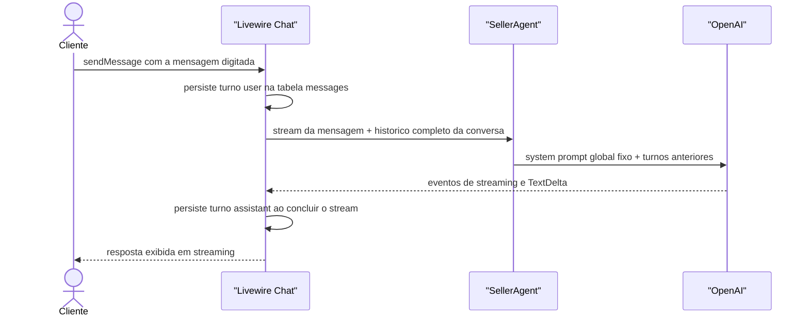
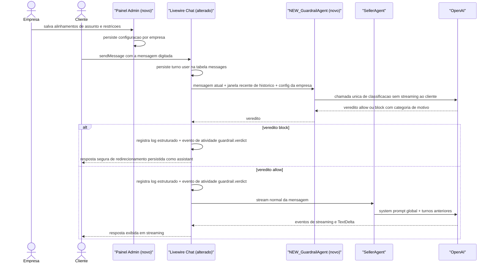

# SPEC: guardrail-agent

## Metadata
- Source: developer description via /plan
- Service: lab-agent-seller (Laravel 13 monolith, Livewire 4 + laravel/ai)
- Tier: standard
- Version: 1.1
- Architecture references: AGENTS.md, docs/agents/architecture.md, docs/agents/domain_rules.md

## Context

Hoje toda mensagem do cliente final vai direto ao `SellerAgent` (agente `laravel/ai`, OpenAI) sem nenhuma camada de proteção: `Chat::sendMessage` persiste o turno do usuário e `Chat::generateResponse` invoca o agente em streaming (verified at app/Livewire/Client/Chat.php:114 e app/Livewire/Client/Chat.php:156). O system prompt do SellerAgent é global e fixo em código (verified at app/Ai/Agents/SellerAgent.php:34) — não há filtro contra prompt injection, jailbreak, mudança de intenção, exposição de PII ou desvio de assunto, nem qualquer configuração por empresa.

Esta feature adiciona uma camada de guardrail implementada como um Agent (`laravel/ai`) que classifica a mensagem atual do cliente mais uma janela recente do histórico ANTES de o SellerAgent processá-la. A empresa (tenant, tabela `users`) configura no painel admin dois campos de texto livre: alinhamentos de assunto permitidos e restrições específicas da empresa. O veredito (allow/block + categoria de motivo) é observável. Mensagem bloqueada nunca chega ao SellerAgent; o cliente recebe uma resposta segura de redirecionamento.

Regras de arquitetura aplicáveis (fonte: AGENTS.md e docs/agents/architecture.md):
- Todas as páginas de UI são componentes Livewire em `app/Livewire/`; controllers permanecem finos (AGENTS.md, seção 2).
- Agentes de IA vivem em `app/Ai/Agents/` com atributos `#[Provider(Lab::OpenAI)]` (docs/agents/architecture.md, directory layout; padrão verificado em app/Ai/Agents/SellerAgent.php:25).
- Valores categóricos são lookup tables Eloquent semeadas por `LookupSeeder`, nunca enums PHP nem colunas enum (AGENTS.md, seção 2).
- Responsabilidade de camada: o agente é dono de prompt/contexto; o componente `Chat` é dono da persistência de turnos (docs/agents/architecture.md, layer responsibilities).

Conflito init-chain vs ACs confirmados: a descrição do projeto (.spec/init/project-description.md) fixa o MVP como "apenas o system prompt global, nada além disso". Os ACs confirmados vencem — esta feature estende deliberadamente esse limite do MVP; não é marcado como clarificação, apenas registrado.

## AS IS — Estado atual

Fluxo atual do chat: toda mensagem do cliente vai direto ao SellerAgent sem nenhuma classificação prévia; não existe configuração de guardrail por empresa nem registro de veredito. Nós verificados em app/Livewire/Client/Chat.php e app/Ai/Agents/SellerAgent.php.

## TO BE — Estado proposto

Estado proposto: o `NEW_GuardrailAgent (novo)` realiza RF-01, RF-02, RF-05 e RF-06 classificando a mensagem antes do SellerAgent; o `Painel Admin (novo)` realiza UI-01 e UI-02 (config por empresa); o `Livewire Chat (alterado)` realiza RF-03, RF-04 e RF-07 (bloqueio, passagem e observabilidade do veredito, contratos CT-01 a CT-03). Nós novos anotados com `(novo)`; o SellerAgent em si não é alterado.

## Scope

- **In**:
  - Agente guardrail que classifica mensagem atual + janela recente de histórico antes do SellerAgent, em toda mensagem inbound do cliente.
  - Detecção e bloqueio de: prompt injection, jailbreak, mudança de intenção, exposição de PII, off-topic e violação de restrições específicas, conforme configuração da empresa.
  - Marcação de mensagens bloqueadas no modelo de dados (`messages`) e exclusão delas (e dos redirecionamentos) do histórico do SellerAgent.
  - Configuração por empresa no painel admin: campo de texto livre para alinhamentos de assunto permitidos e campo para restrições específicas, persistidos por tenant.
  - Resposta segura de redirecionamento ao cliente quando bloqueado, sem invocar o SellerAgent.
  - Observabilidade do veredito (allow/block + categoria) via log estruturado e evento no painel de atividade do chat.
- **Out**:
  - Guardrail de saída (moderação das respostas geradas pelo SellerAgent).
  - Alteração do system prompt ou das tools do SellerAgent.
  - Injeção de dados do CRM no contexto de qualquer agente.
  - Rate limiting, banimento de clientes ou escalonamento humano.
  - Dashboard/tela de histórico de vereditos para a empresa (apenas log/atividade nesta fase).
  - Suporte a outros providers de IA além do OpenAI.

## RIGID (Non-Negotiable)

### Functional Requirements

- RF-01 [Event-Driven]: QUANDO o cliente final envia uma mensagem no chat (`/chat`, rota `client.chat`, verified at routes/web.php:20), o sistema DEVE submeter a mensagem atual mais as últimas 10 mensagens do histórico da conversa (5 pares user/assistant; menos, se a conversa for mais curta) ao agente guardrail ANTES de qualquer invocação do SellerAgent, em toda mensagem inbound sem exceção. Turnos bloqueados anteriores (e suas respostas de redirecionamento) PERMANECEM visíveis na janela de histórico do guardrail.
  - AC: Com providers fakeados, para toda mensagem enviada o guardrail é avaliado exatamente 1 vez, recebe no máximo 10 mensagens de histórico além da atual (incluindo turnos bloqueados), e nenhuma invocação do SellerAgent ocorre antes de existir veredito. (AC1)

- RF-02 [Event-Driven]: QUANDO o guardrail conclui a classificação, o sistema DEVE produzir um veredito com exatamente dois valores possíveis (`allow` | `block`) e, quando `block`, exatamente uma categoria de motivo dentre: `prompt_injection`, `jailbreak`, `intent_change`, `pii`, `off_topic`, `company_restriction`.
  - AC: Toda avaliação resulta em veredito `allow` ou `block`; todo `block` carrega 1 categoria pertencente ao conjunto fechado de 6; nenhum outro valor é aceito. (AC4, AC6)

- RF-03 [Unwanted Behaviour]: SE o veredito for `block`, ENTÃO o SellerAgent NÃO DEVE ser invocado para essa mensagem e o cliente DEVE receber uma resposta segura de redirecionamento — string única fixa em código, em português do Brasil — persistida como turno `assistant` na conversa, que não revela a categoria detectada nem instruções internas do guardrail. A mensagem bloqueada do cliente PERMANECE persistida na tabela `messages`, marcada como bloqueada (flag/marcador no modelo de dados), e tanto ela quanto seu turno `assistant` de redirecionamento DEVEM ser excluídos do histórico enviado ao SellerAgent em TODAS as invocações futuras (permanecem visíveis apenas na janela do guardrail, conforme RF-01).
  - AC: Com guardrail fakeado retornando `block`, o SellerAgent registra 0 invocações, existe 1 novo turno `assistant` persistido com a resposta fixa de redirecionamento, o turno user está persistido e marcado como bloqueado, e o texto exibido não contém a categoria nem trechos do prompt do guardrail. Em mensagem `allow` subsequente na mesma conversa, o contexto enviado ao SellerAgent não contém o turno bloqueado nem o redirecionamento. (AC5)

- RF-04 [Conditional]: SE o veredito for `allow`, ENTÃO o fluxo atual de resposta DEVE prosseguir inalterado: SellerAgent invocado com o mesmo contexto de conversa de hoje — exceto turnos marcados como bloqueados e seus redirecionamentos, que são excluídos (RF-03) — e resposta transmitida em streaming ao cliente.
  - AC: Com guardrail fakeado retornando `allow`, o SellerAgent é invocado exatamente 1 vez e o turno `assistant` persistido é a resposta do SellerAgent, não a mensagem de redirecionamento. (AC1, AC5)

- RF-05 [State-Driven]: ENQUANTO a empresa dona da conversa tiver alinhamentos de assunto e/ou restrições configurados, o guardrail DEVE incorporar exatamente esses textos na classificação (base dos filtros `off_topic` e `company_restriction`). ENQUANTO o campo de alinhamentos estiver vazio, a verificação `off_topic` NÃO se aplica (nenhuma mensagem é bloqueada como off-topic). ENQUANTO o campo de restrições estiver vazio, a verificação `company_restriction` NÃO se aplica. Em ambos os casos, as 4 verificações de ataque (`prompt_injection`, `jailbreak`, `intent_change`, `pii`) permanecem ativas.
  - AC: Teste 1 — empresa com alinhamentos/restrições preenchidos: o prompt enviado ao guardrail contém os textos configurados. Teste 2 — empresa sem alinhamentos: nenhum veredito `block` com categoria `off_topic` é produzido. Teste 3 — empresa sem restrições: nenhum veredito `block` com categoria `company_restriction` é produzido; as demais categorias continuam possíveis. (AC2, AC3, AC4)

- RF-06 [Ubiquitous]: O prompt de classificação do guardrail DEVE conter instruções explícitas e distintas para cada um dos 6 tipos de ataque/filtro: prompt injection, jailbreak, mudança de intenção, PII, off-topic e restrições da empresa, respeitando as seguintes definições:
  - `pii`: bloqueia tentativas de extrair/obter PII de terceiros ou dados internos; o cliente informar voluntariamente os PRÓPRIOS dados de contato (nome, endereço, telefone) para uma compra é permitido.
  - `intent_change`: tentativas de redefinir o papel/persona do assistente ("agora você é...", "aja como..."), ativa independentemente dos alinhamentos configurados.
  - `off_topic`: assunto fora dos alinhamentos configurados, exclusivamente; sem sobreposição com `intent_change`.
  - AC: Inspeção programática das instruções do guardrail encontra os 6 critérios nomeados, incluindo a distinção PII própria vs de terceiros; a ausência de qualquer um falha o teste. Mensagem com o cliente fornecendo os próprios dados de contato para compra resulta em `allow`. (AC4)

- RF-07 [Event-Driven]: QUANDO um veredito é produzido (allow ou block), o sistema DEVE (a) gravar uma entrada de log estruturada contendo no mínimo `conversation_id`, `message_id`, `verdict` e `category` (nula quando `allow`), e (b) emitir um evento `guardrail.verdict` no grupo de atividade "RESPOSTA #N" do painel de atividade do chat existente (padrão de eventos verified at app/Livewire/Client/Chat.php:321).
  - AC: Após cada mensagem processada, existe exatamente 1 entrada de log com os 4 campos e 1 evento `guardrail.verdict` no grupo de atividade da resposta, tanto para `allow` quanto para `block`. (AC6)

- RF-08 [Unwanted Behaviour]: SE a chamada de classificação do guardrail falhar (erro de provider, timeout), ENTÃO o sistema DEVE aplicar fail-closed: a mensagem é tratada como bloqueada (SellerAgent NÃO invocado; cliente recebe a resposta fixa de redirecionamento de RF-03; mensagem marcada como bloqueada), com registro da falha no log estruturado com `verdict` = `error` e `category` = nulo, e emissão do evento de atividade `guardrail.verdict` correspondente (CT-02).
  - AC: Com o provider do guardrail fakeado para lançar erro, o SellerAgent registra 0 invocações, o cliente recebe o redirecionamento seguro, existe 1 entrada de log com `verdict` = `error` e `category` nula, 1 evento `guardrail.verdict` no painel de atividade, e a mensagem do cliente permanece persistida e marcada como bloqueada.

### UI Requirements

- UI-01 [Event-Driven]: QUANDO a empresa autenticada (guard `auth`, painel `/dashboard`, verified at routes/web.php:30) acessa a configuração do agente, o sistema DEVE exibir um campo de texto livre (textarea) para "alinhamentos de assunto" permitidos, e QUANDO a empresa salva, o valor DEVE ser persistido vinculado exclusivamente àquela empresa e reexibido preenchido no próximo acesso.
  - AC: Salvar um texto e recarregar a página exibe o mesmo texto; outra empresa autenticada não vê nem afeta esse valor. (AC2)

- UI-02 [Event-Driven]: QUANDO a empresa acessa a mesma configuração, o sistema DEVE exibir um segundo campo de texto livre para "restrições específicas da empresa", com a mesma persistência por tenant e reexibição de UI-01.
  - AC: Salvar e recarregar preserva o valor; isolamento entre empresas idêntico ao de UI-01. (AC3)

- UI-03 [Conditional]: SE ambos os campos estiverem vazios (estado inicial de toda empresa existente), ENTÃO o formulário DEVE salvar sem erro (campos opcionais) e o chat DEVE continuar funcionando conforme RF-05.
  - AC: Empresa recém-criada salva o formulário vazio sem erro de validação e o chat do seu cliente continua respondendo. (AC2, AC3)

### Contracts

- CT-01 — Veredito do guardrail (contrato interno, consumido pelo fluxo do chat):
  - `verdict`: `allow` | `block` (obrigatório; saída da classificação)
  - `category`: `prompt_injection` | `jailbreak` | `intent_change` | `pii` | `off_topic` | `company_restriction` (obrigatório quando `block`; nulo quando `allow`)
- CT-02 — Evento de atividade `guardrail.verdict` (painel de atividade do chat, mesmo formato dos eventos existentes `request.started`/`stream.start` — verified at app/Livewire/Client/Chat.php:341): `type` = `guardrail.verdict`, `summary` legível em PT-BR, `payload` = `{ verdict, category }` onde `verdict` ∈ `allow` | `block` | `error` (`error` = falha de classificação, RF-08; `category` nula nesse caso).
- CT-03 — Entrada de log estruturada do veredito: contexto mínimo `{ conversation_id: int, message_id: int, verdict: string, category: string|null }` com `verdict` ∈ `allow` | `block` | `error`; NUNCA inclui o conteúdo bruto da mensagem do cliente (ver RNF-03).

### Non-Functional Requirements

- RNF-01 (Isolamento multi-tenant): A avaliação do guardrail DEVE usar exclusivamente a configuração da empresa dona da conversa (`conversations.user_id`); 0 vazamentos entre tenants.
  - AC: Teste com 2 empresas com configs distintas — o prompt do guardrail de cada conversa contém apenas a config da empresa correspondente.
- RNF-02 (Custo/latência estrutural): O guardrail DEVE adicionar exatamente 1 chamada de modelo adicional por mensagem inbound, sem streaming ao cliente e sem fan-out (0 tools, 0 chamadas recursivas).
  - AC: Com providers fakeados, o total de chamadas de IA por mensagem permitida é 2 (guardrail + SellerAgent) e por mensagem bloqueada é 1.
- RNF-03 (Privacidade nos logs): As entradas de log do veredito NÃO DEVEM conter o conteúdo bruto da mensagem do cliente (em especial quando `category` = `pii`), apenas ids, veredito e categoria.
  - AC: Inspeção do contexto logado em teste com mensagem contendo PII sintética — a string da mensagem não aparece no log.

## FLEXIBLE (Implementation Suggestions)

- Classe `App\Ai\Agents\GuardrailAgent` ao lado do `SellerAgent`, com `#[Provider(Lab::OpenAI)]` e saída estruturada (structured output do `laravel/ai`) mapeando CT-01; `providerOptions` com `reasoning.effort = low` como no SellerAgent para minimizar latência.
- Orquestração no ponto já existente: `Chat::generateResponse` chama o guardrail antes de instanciar o `SellerAgent` (app/Livewire/Client/Chat.php:139); alternativa: extrair um service `App\Services\Guardrail\GuardrailService` se o componente crescer demais.
- Persistência da config: duas colunas `text` nullable na tabela `users` (ex.: `guardrail_topic_alignments`, `guardrail_restrictions`) — simples e coerente com "empresa = users"; alternativa: tabela própria `agent_settings` 1:1 com `users` se mais campos de agente forem previstos.
- UI admin: componente Livewire `app/Livewire/Agent/Settings` (ou seção no dashboard existente), seguindo a convenção "todas as páginas de UI são Livewire" (AGENTS.md seção 2), com `x-input`/`x-button` do design system.
- Se no futuro o veredito for persistido em banco, a categoria deve virar lookup table (convenção do projeto: sem enums PHP/colunas enum — AGENTS.md seção 2); no escopo atual (log-only) strings no log bastam.
- Evento de atividade: reutilizar `pushActivityEvent()` e o componente `x-agent-event` existentes; sugerir `type` visual próprio para `guardrail.verdict` bloqueado (tom `warn`/`danger`).
- Testes: seguir o padrão de `tests/Feature/ChatTest.php` com `GuardrailAgent::fake()` / `SellerAgent::fake()` e asserções de prompt (`assertPrompted`).

## Acceptance Criteria Summary

| ID | Criterion | Testable? |
|----|-----------|-----------|
| RF-01 | Guardrail avaliado 1x antes de qualquer chamada ao SellerAgent, com janela de até 10 mensagens | Yes (fakes) |
| RF-02 | Veredito fechado allow/block + categoria dentre 6 valores | Yes |
| RF-03 | Block → 0 invocações do SellerAgent + redirecionamento fixo persistido + mensagem marcada como bloqueada e excluída do histórico do SellerAgent | Yes (fakes) |
| RF-04 | Allow → fluxo de streaming atual inalterado (sem turnos bloqueados no contexto) | Yes (fakes) |
| RF-05 | Config da empresa injetada; campos vazios desativam apenas off_topic/company_restriction | Yes (assertPrompted) |
| RF-06 | Prompt do guardrail contém os 6 critérios nomeados com definições de PII/intent_change/off_topic | Yes (inspeção) |
| RF-07 | 1 log estruturado + 1 evento guardrail.verdict por mensagem | Yes |
| RF-08 | Falha do guardrail → fail-closed + log verdict=error + evento de atividade | Yes (fakes) |
| UI-01 | Campo de alinhamentos salva, reexibe e isola por empresa | Yes |
| UI-02 | Campo de restrições salva, reexibe e isola por empresa | Yes |
| UI-03 | Campos vazios salvam sem erro; chat segue funcionando | Yes |
| RNF-01 | Config usada é exclusivamente a da empresa da conversa | Yes |
| RNF-02 | Exatamente 1 chamada adicional de modelo por mensagem | Yes (fakes) |
| RNF-03 | Log do veredito sem conteúdo bruto da mensagem | Yes |

## Open Markers

Nenhum. Marcadores de RF-01 (janela = 10 mensagens) e RF-08 (fail-closed) resolvidos na versão 1.1 via clarifier-answers.
