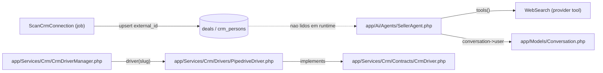
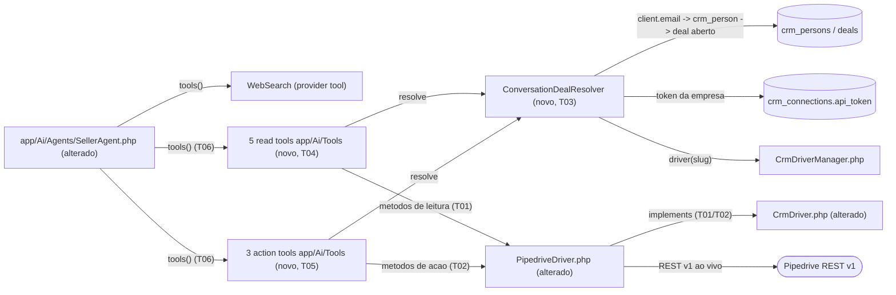

# Implementation Plan

## Request Summary
- Objective: Dar ao `SellerAgent` 8 tools `laravel/ai` para visibilidade e ação ao vivo sobre o deal do cliente no Pipedrive (5 leituras + 3 mutações), com toda identidade (token, `crm_person`, deal externo, identidade do cliente) resolvida app-side a partir da `Conversation` — nenhum identificador entra no schema exposto ao LLM.
- Scope:
  - In: novos métodos de leitura/ação no contrato `CrmDriver` + `PipedriveDriver`; serviço app-side `ConversationDealResolver`; 8 tools sob `app/Ai/Tools/`; wiring em `SellerAgent::tools()` (mantendo `WebSearch`).
  - Out: novas tabelas/migrations (RNF-01 — 0 migrations); outros provedores de CRM; edição de título/valor, criação de deals/persons; mudanças no fluxo de streaming/persistência do `Chat` além de expor as tools.
- Tier: standard
- Architecture references: `docs/agents/architecture.md`, `docs/agents/domain_rules.md` (validados — layering aplicado abaixo)

Regras de layering aplicadas (de `docs/agents/architecture.md` "Layer responsibilities"):
- `CrmDriver`/`PipedriveDriver` = "Provider HTTP, token validation, paginated fetch"; **NÃO** "Persistence, cross-reference resolution" → novos métodos recebem `string $token` + ids externos já resolvidos; a resolução cliente→pessoa→deal fica no serviço app-side, nunca no driver.
- `SellerAgent` = "System prompt, conversation context, provider options"; **NÃO** persistência → cada tool carrega a orquestração identidade+driver; o agente apenas as lista em `tools()`.
- Driver resolvido por `CrmDriverManager::driver($connection->crmProvider->slug)`; token via `conversation->user->crmConnection->api_token` (cast `encrypted`), isolamento de tenant (RNF-02).

## AS IS — Componentes impactados

Legenda: hoje `SellerAgent::tools()` retorna apenas `WebSearch(maxSearches: 3)`; `PipedriveDriver` só expõe `validateToken` + `fetch*` de scan; os mirrors `deals`/`crm_persons` não são lidos em runtime pelo agente. Não há resolução de identidade app-side nem chamada ao Pipedrive durante o chat.

## TO BE — Componentes propostos

Legenda: `SellerAgent::tools()` (alterado por T06) passa a listar `WebSearch` + 5 read tools (T04) + 3 action tools (T05). Cada tool delega ao `ConversationDealResolver` (T03) a resolução app-side de token, `crm_person` e deal aberto, e chama os novos métodos de leitura (T01) / ação (T02) do `PipedriveDriver`/`CrmDriver` (alterados). Nenhum id entra no schema exposto ao LLM.

## Tasks

### T01 — Métodos de LEITURA no contrato CrmDriver + PipedriveDriver
- **Files**: `app/Services/Crm/Contracts/CrmDriver.php`, `app/Services/Crm/Drivers/PipedriveDriver.php`
- **Change**: Adicionar ao contrato e implementar no driver, cada um recebendo `string $token` + ids externos já resolvidos (nenhuma identidade de cliente/empresa além do token): `fetchDeal(string $token, string $dealExternalId): array` (`GET /deals/{id}` → title, value, stage_external_id, status; campos ausentes ficam `null`, sem fabricação — RF-01); `fetchDealStageChanges(string $token, string $dealExternalId): iterable` (`GET /deals/{id}/flow` filtrando SÓ eventos de mudança de estágio → origem, destino, momento; demais eventos descartados — RF-02); `fetchDealComments(string $token, string $dealExternalId): iterable` (RF-03); `fetchNotes(string $token, ?string $dealExternalId, ?string $personExternalId): iterable` retornando lista mesclada com cada item rotulado por origem `deal`/`person` (`GET /notes?deal_id=` + `GET /notes?person_id=`; pessoa disponível mesmo sem deal — RF-04); `fetchPipelinesWithStages(string $token): iterable` (pipelines com stages contendo `id` = id externo Pipedrive + `name` — RF-05). Reutilizar `Http::` + `config('services.pipedrive.base_url')` + `api_token` query param; falha de rede/não-2xx lança `CrmApiException` (padrão existente). Um id resolvido que retorna 404 ao vivo LANÇA `CrmApiException` (RF-11), não retorna vazio.
- **Covers**: RF-01, RF-02, RF-03, RF-04, RF-05, CT-02, RNF-01
- **Tests**: `tests/Feature/Crm/PipedriveDriverReadTest.php` (Pest, `Http::fake`) — dados do deal com marcadores null quando ausentes; flow filtrado só a mudanças de estágio; comentários; notas mescladas rotuladas deal/person; pipelines com stages id+name; não-2xx e `ConnectionException` lançam `CrmApiException`; 404 em `fetchDeal` lança `CrmApiException`.
- **Risk**: Medium — shapes/endpoints REST v1 (`/deals/{id}/flow`, `/notes`, comentários) estão marcados `?` no SPEC (não verificados no código atual); ver Open Questions Q-1.
- **Dependencies**: none

### T02 — Métodos de AÇÃO no contrato CrmDriver + PipedriveDriver
- **Files**: `app/Services/Crm/Contracts/CrmDriver.php`, `app/Services/Crm/Drivers/PipedriveDriver.php`
- **Change**: Adicionar/implementar, recebendo `string $token` + deal externo resolvido + parâmetro de negócio: `moveDealStage(string $token, string $dealExternalId, string $stageExternalId): void` (`PUT /deals/{id}` com `stage_id` = id externo, sem tradução local↔externo — RF-06); `markDealWon(string $token, string $dealExternalId): void` (`PUT /deals/{id}` `status=won` — RF-07); `markDealLost(string $token, string $dealExternalId, ?string $lostReason = null): void` (`PUT /deals/{id}` `status=lost` + `lost_reason` texto livre repassado como está quando presente — RF-08). Falha de provider lança `CrmApiException`. A validação same-pipeline (RF-06) e a recusa sobre deal fechado (RF-12) NÃO ficam aqui — são app-side (T05).
- **Covers**: RF-06, RF-07, RF-08, CT-03
- **Tests**: `tests/Feature/Crm/PipedriveDriverActionTest.php` (`Http::fake`) — PUT de move envia `stage_id`; won envia `status=won`; lost envia `status=lost` e, com motivo, `lost_reason` idêntico ao informado; não-2xx/`ConnectionException` lançam `CrmApiException`.
- **Risk**: Medium — payload exato do `PUT /deals/{id}` para status/lost_reason não verificado no código atual (Q-1).
- **Dependencies**: T01 (mesmos dois arquivos — sequencial)

### T03 — Serviço app-side ConversationDealResolver
- **Files**: `app/Services/Crm/ConversationDealResolver.php` (novo)
- **Change**: Serviço que recebe `Conversation` e resolve, sem expor nada ao LLM: (a) `token` = `conversation->user->crmConnection->api_token`; (b) driver = `CrmDriverManager::driver($connection->crmProvider->slug)`; (c) `crm_persons` casadas por `Str::lower(trim($conversation->client->email))` comparado case-insensitive a `crm_persons.email` ESCOPADO ao `crm_connection` de `conversation->user` (isolamento de tenant, RNF-02) — consistente com a normalização de magic-link em `domain_rules`; (d) UNION dos deals de todas as pessoas casadas; (e) deal resolvido = deal com `deal_status` slug `open` mais recentemente atualizado (`whereHas('dealStatus', slug=open')->orderByDesc('updated_at')->first()` — RF-12). Retornar um objeto/estrutura de resolução expondo: `token`, `driver`, `personExternalIds` (para notas mesmo sem deal — RF-04/RF-10), `deal` resolvido (com `external_id`, `pipeline_external_id`, `status`) ou `null`. Quando não há empresa/conexão, pessoa casada ou deal aberto → `deal = null` (estado "sem deal" de RF-10), com `personExternalIds` ainda preenchido quando houver pessoa casada. Nenhuma chamada HTTP aqui (só resolução de ids do mirror local); o mirror serve apenas à resolução, nunca como resposta de tool (RNF-01).
- **Covers**: RF-09 (resolução app-side), RF-10 (estado sem-deal), RF-12 (seleção do deal aberto mais recente), RNF-02
- **Tests**: `tests/Feature/Crm/ConversationDealResolverTest.php` — casamento case-insensitive (`Str::lower(trim)`); escopo por tenant (conversa da empresa A não casa `crm_person`/deal da empresa B); UNION de deals de múltiplas pessoas casadas; seleciona o deal aberto com maior `updated_at`; só deals fechados → `deal = null` mas `personExternalIds` presente; cliente sem match → `deal = null` e `personExternalIds` vazio; empresa sem `crmConnection` → resolução vazia sem erro.
- **Risk**: Medium — coração da correção de segurança multi-tenant (RNF-02) e do RF-09; erro aqui vaza dado entre empresas.
- **Dependencies**: none (paralelizável com T01)

### T04 — 5 tools de leitura sob app/Ai/Tools
- **Files**: `app/Ai/Tools/GetDealDataTool.php`, `app/Ai/Tools/GetDealStageHistoryTool.php`, `app/Ai/Tools/GetDealCommentsTool.php`, `app/Ai/Tools/GetDealNotesTool.php`, `app/Ai/Tools/ListPipelinesTool.php` (novos)
- **Change**: Cada tool implementa `Laravel\Ai\Contracts\Tool`, recebe `Conversation` por construtor (a partir de `SellerAgent`), `schema()` retorna `[]` (nenhum parâmetro — CT-04/RF-09), e `handle()`: resolve via `ConversationDealResolver` e chama o método de leitura correspondente (T01). Regras: campos ausentes de estágio/status viram marcador nulo/"desconhecido" explícito, distinto do "sem deal" (RF-01); sem deal resolvível → marcador explícito "sem deal encontrado" (RF-10) para GetDealData/StageHistory/Comments; GetDealNotes ainda retorna as notas da pessoa quando há pessoa mas não deal (RF-04/RF-10); ListPipelines independe de deal e sempre retorna pipelines+stages (RF-05/RF-10); qualquer `CrmApiException`/falha é capturada e convertida em marcador de falha para o modelo ("não consegui confirmar") SEM nome de tool, id ou stacktrace no texto (RF-11/RNF-03). Descrições PT-BR orientando o modelo. Considerar payloads grandes (ver T06 broadcasting).
- **Covers**: RF-01, RF-02, RF-03, RF-04, RF-05, RF-09, RF-10, RF-11, CT-01, CT-04, RNF-01, RNF-03
- **Tests**: `tests/Feature/Ai/Tools/ReadToolsTest.php` (`Http::fake` do Pipedrive + factories) — `schema()` de cada tool é vazio (nenhum campo `deal_id/person_id/client_id/user_id/company_id/email/token`); GetDealData retorna title/value/estágio/status ao vivo e marcador null quando Pipedrive omite estágio/status; StageHistory só mudanças de estágio; Comments; Notes mescladas rotuladas e ainda retorna notas da pessoa sem deal; ListPipelines disponível sem deal; sem deal resolvível → marcador "sem deal"; falha do Pipedrive → marcador de falha sem vazar tool/id/erro.
- **Risk**: Medium — superfície LLM-facing; RF-09/RF-11 são hard constraints.
- **Dependencies**: T01, T03

### T05 — 3 tools de ação sob app/Ai/Tools
- **Files**: `app/Ai/Tools/MoveDealStageTool.php`, `app/Ai/Tools/MarkDealWonTool.php`, `app/Ai/Tools/MarkDealLostTool.php` (novos)
- **Change**: Cada tool implementa `Tool`, recebe `Conversation` por construtor. Schemas (CT-04): `MoveDealStageTool` → `stage_id` string required (id externo de stage do Pipedrive vindo de RF-05); `MarkDealLostTool` → `lost_reason` string opcional (texto livre); `MarkDealWonTool` → `[]`. `handle()` resolve via `ConversationDealResolver`; sem deal resolvível → marcador "sem deal" (RF-10). Antes de qualquer mutação: se o deal resolvido estiver `won`/`lost` (fechado) → RECUSAR com marcador explícito, nunca chamar o driver (RF-12). `MoveDealStageTool` valida same-pipeline app-side: obtém o pipeline do deal (via `fetchDeal`/mirror) e o pipeline do `stage_id` alvo (via `fetchPipelinesWithStages`, T01); estágio de outro pipeline → RECUSA com marcador (RF-06). Só então chama `moveDealStage`/`markDealWon`/`markDealLost` (T02). Falha → marcador "não consegui confirmar" sem vazamento (RF-11/RNF-03). `lost_reason` repassado como está (RF-08).
- **Covers**: RF-06, RF-07, RF-08, RF-09, RF-10, RF-11, RF-12 (recusa deal fechado), CT-01, CT-03, CT-04, RNF-03
- **Tests**: `tests/Feature/Ai/Tools/ActionToolsTest.php` (`Http::fake` + factories) — `MoveDealStageTool` schema só tem `stage_id`; move para estágio do mesmo pipeline chama PUT correto; `stage_id` de outro pipeline → recusa sem PUT; `MarkDealWonTool` schema vazio, marca `won`; `MarkDealLostTool` schema só `lost_reason`, marca `lost` e repassa motivo; deal já fechado → todas recusam com marcador e não chamam o driver; sem deal → marcador "sem deal"; falha → marcador de falha sem vazar tool/id.
- **Risk**: High — mutações irreversíveis no CRM do cliente; recusa sobre deal fechado (RF-12) e same-pipeline (RF-06) são invariantes de correção.
- **Dependencies**: T02, T03

### T06 — Wiring das 8 tools em SellerAgent::tools() + broadcasting
- **Files**: `app/Ai/Agents/SellerAgent.php`, `tests/Feature/ChatTest.php`
- **Change**: `tools()` passa a retornar `WebSearch(maxSearches: 3)` MAIS as 8 tools desta feature, cada uma instanciada com `$this->conversation` (CT-01). Avaliar `#[WithoutBroadcasting(ToolResult::class)]` (import `Laravel\Ai\Streaming\Events\ToolResult`) se payloads de leitura excederem o frame WebSocket do painel de atividade (FLEXIBLE do SPEC). Atualizar o teste existente `agent_exposes_web_search_tool` em `tests/Feature/ChatTest.php:58` — hoje espera `toHaveCount(1)`; passa a esperar 9 tools, com `WebSearch(maxSearches: 3)` presente e as 8 tools instanciáveis (cada uma recebe a `Conversation`). Não alterar `instructions()`/prompt: o bloco `<tools>` já cobre RF-11/RNF-03.
- **Covers**: CT-01
- **Tests**: `tests/Feature/ChatTest.php` — `agent_exposes_web_search_tool` (atualizado): `tools()` retorna 9 itens; contém `WebSearch` com `maxSearches = 3`; as 8 novas tools estão presentes e são instâncias de `Laravel\Ai\Contracts\Tool`.
- **Risk**: Medium — alterar a contagem de tools regride o teste existente se não atualizado; wiring incorreto quebra o chat.
- **Dependencies**: T04, T05

## Execution Phases
| Phase | Tasks | Parallel-safe? |
|-------|-------|----------------|
| Phase 1 | T01, T03 | Sim — arquivos disjuntos (driver vs serviço novo) |
| Phase 2 | T02 | N/A — único; sequencial após T01 (mesmos arquivos do driver) |
| Phase 3 | T04, T05 | Sim — conjuntos de arquivos de tool disjuntos |
| Phase 4 | T06 | N/A — único; depende de T04+T05 |

## Risks
| Risk | Blast radius | Mitigation | Rollback |
|------|-------------|------------|----------|
| Endpoints/shapes REST v1 do Pipedrive (`/deals/{id}/flow`, `/notes`, comentários, PUT status/lost_reason) marcados `?` no SPEC e não verificados no código | T01, T02 (driver) e por consequência as tools | Confirmar na doc oficial do Pipedrive antes de implementar (Q-1); centralizar parsing no driver com normalização defensiva (padrão `idValue`/`primaryValue` existente); `Http::fake` cobrindo os shapes assumidos | Reverter métodos novos do driver; contrato antigo permanece intacto |
| Vazamento cross-tenant na resolução de identidade (RNF-02) | T03 e todas as tools | Escopo estrito ao `crm_connection` de `conversation->user`; teste dedicado empresa A×B; nenhuma tool recebe token/id do LLM | Reverter T03; sem tools expostas o agente volta ao comportamento atual |
| Mutação indevida em deal fechado ou cross-pipeline (RF-06/RF-12) | T05 (ações) — dados reais do CRM do cliente | Recusa app-side antes da chamada ao driver; testes de deal fechado e stage de outro pipeline; mutações nunca miram deal fechado silenciosamente | Remover as 3 action tools de `tools()` (T06) mantendo só as leituras |
| Vazamento de nome de tool/id/erro técnico ao cliente (RF-11/RNF-03) | T04, T05 (texto entregue ao cliente) | Marcadores de falha genéricos; system prompt `<tools>`/`<guardrails>` já instrui "não consegui confirmar"; testes asseguram ausência de tool/id/stacktrace | Remover tools de `tools()` (T06) |
| Payload de leitura excede frame WebSocket do painel de atividade | Streaming do `Chat` | `#[WithoutBroadcasting(ToolResult::class)]` (T06); eventos ainda streamam/persistem, só não broadcastam | Remover o atributo |
| Regressão do teste `agent_exposes_web_search_tool` (esperava 1 tool) | Suíte de testes | Atualizar o teste em T06 junto ao wiring | Reverter T06 |

## Open Questions
- Q-1 [BLOQUEIA T01/T02 parcialmente]: Os endpoints/payloads REST v1 do Pipedrive para flow de estágios (`GET /deals/{id}/flow`), comentários vs notas (`GET /notes?deal_id=` / `?person_id=` e endpoint de comentários), e o `PUT /deals/{id}` para `status=won`/`status=lost`+`lost_reason` e `stage_id` estão marcados `?` no SPEC (FLEXIBLE) e não aparecem no código atual (`PipedriveDriver` só usa `/users/me`, `/pipelines`, `/stages`, `/personFields`, `/dealFields`, `/persons`, `/deals`). Confirmar na doc oficial antes de congelar os shapes no driver. Impacto: parsing/erros das 5 leituras e 3 ações; mitigado por normalização defensiva + `Http::fake`.
- Q-2: RF-02 pede "estágio de origem e destino" da mudança de estágio. O `/deals/{id}/flow` do Pipedrive tende a expor `old_value`/`new_value` como ids de stage; decidir se a tool traduz esses ids para nomes (via `fetchPipelinesWithStages`) ou os repassa como ids. Recomendação: enriquecer com nome quando barato, mantendo o id — não bloqueia, mas afeta a legibilidade para o modelo. Alinha com RF-05 (id externo é a fonte).

## Assumptions
- [UNVERIFIED] O `deal_status` local (`deal_statuses` lookup, slugs `open`/`won`/`lost` — confirmado em `database/seeders/LookupSeeder.php:31-33`) reflete com frescor suficiente o status para a seleção RF-12; a mutação, porém, valida o status ao vivo/refuta deal fechado no momento da ação (T05), então a decisão final não depende só do mirror.
- [UNVERIFIED] Um `crm_person` casado tem no máximo os deals de sua própria conexão; o UNION de deals de múltiplas pessoas casadas na mesma conexão é o universo de seleção (RF-09/RF-12). Fonte: `app/Models/CrmPerson.php:44` (`hasMany Deal`), `deals.crm_connection_id`.
- As tools recebem a `Conversation` por construtor a partir de `SellerAgent::tools()` (padrão `new GetDealDataTool($this->conversation)`), coerente com `WebSearch` instanciada em `tools()` e com o construtor `Conversation $conversation` do agente (verificado em `app/Ai/Agents/SellerAgent.php:103-107`).
- `CrmApiException extends RuntimeException` (verificado) é o único tipo de falha de provider a capturar nas tools para o comportamento RF-11; `ConnectionException` já é convertida em `CrmApiException` dentro do driver (padrão `paginate`).
- Nenhum artefato de contrato formal (OpenAPI/gRPC/AsyncAPI) é emitido: os "Contracts" do SPEC (CT-01..CT-04) são contratos PHP internos de método/schema, não uma superfície de API pública versionada — fora do gatilho de emissão de contratos.
