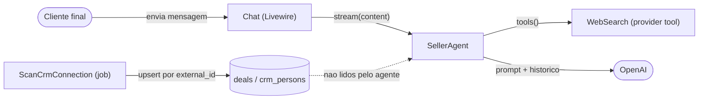
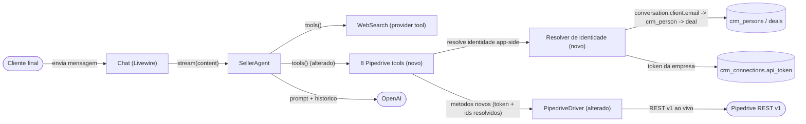

# SPEC: seller-agent-pipedrive-tools

## Metadata
- Source: developer description via /plan
- Service: lab-agent-seller (Laravel 13 monolith, single repo)
- Tier: standard
- Version: 1.1
- Architecture references: `docs/agents/architecture.md`, `docs/agents/domain_rules.md` (init grounding: `.spec/init/project-description.md`, `.spec/init/user-stories.md`, `.spec/init/database-schema.md`, `.spec/init/project-phases.md`)

## Context

`SellerAgent` (`app/Ai/Agents/SellerAgent.php`, `#[Provider(Lab::OpenAI)]`, `#[Model('gpt-5.6-terra')]`) is the final-client-facing commercial agent. It already speaks per-conversation (constructor `Conversation $conversation`), renders the company playbook into a fixed system prompt, and exposes exactly one provider tool today — `WebSearch(maxSearches: 3)` (verified at `app/Ai/Agents/SellerAgent.php:135`). Its `<tools>` prompt block already instructs it to consult tools before asserting business data, to say "não consegui confirmar" transparently on tool failure, and to never leak tool names/errors/ids to the client — but no CRM-data tool is wired yet.

The company's Pipedrive data is mirrored locally by `ScanCrmConnection` into `crm_persons` and `deals` (keyed by `(crm_connection_id, external_id)`), yet the agent never reads it. `PipedriveDriver` (`app/Services/Crm/Drivers/PipedriveDriver.php`) already owns provider HTTP against `config('services.pipedrive.base_url')` (default `https://api.pipedrive.com/v1`, verified at `config/services.php:39`) with the personal API token as the `api_token` query param; the token is resolved from the company's `crm_connections.api_token` (cast `encrypted`, verified at `app/Models/CrmConnection.php:35`).

This feature gives `SellerAgent` 8 tools for full Pipedrive visibility of the client it is chatting with (5 live read tools + 3 deal-mutation actions), following the `HasTools`/`laravel/ai` convention. The hard invariant: every identifier (company token, deal external id, `crm_person` id, client identity) is resolved **app-side** from the injected `Conversation` (`conversation->client` for the final client, `conversation->user` for the company, verified at `app/Ai/Agents/SellerAgent.php:115`); no identifier ever appears in an LLM-exposed tool input schema.

Architecture rules honored (from `docs/agents/architecture.md` "Layer responsibilities"):
- `CrmDriver` / `PipedriveDriver` owns "Provider HTTP, token validation, paginated fetch"; it does **NOT** own "Persistence, cross-reference resolution". → New Pipedrive read/action operations are added as `CrmDriver` contract methods + `PipedriveDriver` implementations that receive a token + already-resolved external ids; the client→person→deal resolution lives app-side, never in the driver.
- `SellerAgent` owns "System prompt, conversation context, provider options"; it does **NOT** own persistence. → Tools carry the identity-resolution + driver-call orchestration; the agent only lists them via `tools()`.
- Driver resolution stays through `CrmDriverManager::driver('pipedrive')` (verified at `app/Services/Crm/CrmDriverManager.php`); multi-tenant token comes from the conversation's company `crm_connection` (`docs/agents/domain_rules.md` "CRM token validation states" / "Company (tenant) = users row; owns at most one crm_connection").

## AS IS — Estado atual

Legenda: hoje o `SellerAgent` só expõe `WebSearch`; os `deals` e `crm_persons` escaneados do Pipedrive ficam armazenados localmente pelo `ScanCrmConnection`, mas o agente não os lê nem chama o `PipedriveDriver` em runtime. Não há visibilidade ao vivo do negócio do cliente nem ação sobre o deal.

## TO BE — Estado proposto

Legenda: o `SellerAgent` passa a expor, além do `WebSearch`, 8 tools Pipedrive (RF-01…RF-08). Cada tool resolve token, `crm_person` e deal externo app-side a partir da `Conversation` (RF-09) e chama novos métodos de leitura ao vivo (RF-01…RF-05, RF-10) e de mutação (RF-06…RF-08) no `PipedriveDriver` (alterado) / contrato `CrmDriver` (CT-02, CT-03). Nenhum id entra no schema exposto ao LLM (RF-09, CT-04).

## Scope

- **In**:
  - 8 `laravel/ai` tools registrados em `SellerAgent::tools()` (mantendo o `WebSearch` existente): 5 de leitura ao vivo (dados do deal, timeline/flow de mudança de estágio, comentários, notas, listagem de pipelines+stages) e 3 de ação (mover para estágio, marcar ganho, marcar perdido).
  - Novos métodos no contrato `CrmDriver` e na implementação `PipedriveDriver` para essas leituras e ações, sempre recebendo token + ids externos já resolvidos.
  - Resolução app-side de token, identidade do cliente, `crm_person` e deal externo a partir da `Conversation` injetada.
- **Out**:
  - Novas tabelas/migrations locais para as leituras ao vivo (leituras vão ao Pipedrive a cada chamada — RNF-01).
  - Outros provedores de CRM além do Pipedrive (contrato fica agnóstico, mas só o driver Pipedrive é implementado nesta feature).
  - Edição de título/valor do deal, criação de deals, criação de persons, e qualquer ação não listada nas 8 tools.
  - Mudanças no fluxo de streaming/persistência do `Chat` além de expor as novas tools.

## RIGID (Non-Negotiable)

### Functional Requirements

- RF-01 [Event-Driven]: WHEN o modelo invoca a tool de dados do deal, o sistema DEVE retornar os dados ao vivo do deal da conversa (title, value, estágio atual, status) buscados no Pipedrive naquela chamada, sem que o modelo forneça qualquer id. Os campos são retornados como fornecidos pelo Pipedrive; quando estágio e/ou status estiverem ausentes na resposta, o sistema DEVE emitir marcadores explícitos de nulo/"desconhecido" (ex.: "sem estágio"), NUNCA fabricar valor. O marcador "sem estágio" é semanticamente distinto do "sem deal" de RF-10.
  - AC: Dada uma conversa cujo cliente casa com um `crm_person` que possui deal no Pipedrive, chamar a tool retorna title, value, nome do estágio atual e status do deal correspondente, e nenhum id de deal/pessoa foi passado pelo modelo. Quando o Pipedrive não retorna estágio/status, o retorno traz marcador nulo/"desconhecido" explícito (distinto de "sem deal"). (AC-1)

- RF-02 [Event-Driven]: WHEN o modelo invoca a tool de histórico de estágios, o sistema DEVE retornar a timeline/flow de mudanças de estágio do deal da conversa buscada ao vivo no Pipedrive. O sistema DEVE filtrar o stream `/deals/{id}/flow` apenas aos eventos de mudança de estágio (origem, destino, momento), descartando os demais tipos de evento do flow.
  - AC: A tool retorna a sequência de mudanças de estágio (estágio de origem, estágio de destino e momento) do deal resolvido a partir da conversa; eventos de flow que não são mudança de estágio não aparecem no retorno. (AC-2)

- RF-03 [Event-Driven]: WHEN o modelo invoca a tool de comentários, o sistema DEVE retornar os comentários do deal da conversa buscados ao vivo no Pipedrive.
  - AC: A tool retorna a lista de comentários do deal resolvido a partir da conversa (conteúdo e momento de cada comentário), sem id passado pelo modelo. (AC-3)

- RF-04 [Event-Driven]: WHEN o modelo invoca a tool de notas, o sistema DEVE buscar ao vivo no Pipedrive TANTO as notas do deal QUANTO as notas da pessoa (`crm_person`) da conversa e retornar uma lista única mesclada, com cada item marcado por sua origem (deal ou pessoa). Quando não há deal resolvível, as notas da pessoa permanecem disponíveis via RF-10.
  - AC: A tool retorna uma lista mesclada de notas do deal e da pessoa resolvidos a partir da conversa, cada nota rotulada com sua origem (deal/pessoa). Sem deal resolvível, ainda retorna as notas da pessoa. (AC-4)

- RF-05 [Event-Driven]: WHEN o modelo invoca a tool de listagem de pipelines, o sistema DEVE retornar todos os pipelines e seus stages com id E nome de cada um, buscados ao vivo no Pipedrive. O `id` exposto é o **id externo de stage do Pipedrive** (não há id local nem tradução local↔externo); RF-06 aceita exatamente esse mesmo id externo.
  - AC: A tool retorna a lista de pipelines, cada um com seus stages contendo `id` (id externo do Pipedrive) e `name`, permitindo ao modelo escolher um estágio-alvo. (AC-5)

- RF-06 [Event-Driven]: WHEN o modelo invoca a tool de mover deal informando um estágio-alvo (id externo do Pipedrive vindo de RF-05), o sistema DEVE mover o deal da conversa para esse estágio no Pipedrive via PUT ao vivo do id externo, sem tradução local↔externo. O sistema DEVE validar que o estágio-alvo pertence ao MESMO pipeline do deal atual (movimentação same-pipeline apenas) e RECUSAR estágios de outro pipeline. Se o deal resolvido já estiver `won`/`lost` (fechado), a mutação DEVE RECUSAR com marcador explícito, NUNCA reabrir/mover silenciosamente (ver RF-12).
  - AC: Após a chamada com um `stage_id` externo válido do mesmo pipeline do deal, o deal resolvido da conversa está no estágio-alvo no Pipedrive; o único identificador aceito no schema é o id externo de estágio (config estrutural). Um `stage_id` de outro pipeline é recusado; um deal já fechado é recusado com marcador explícito. (AC-6)

- RF-07 [Event-Driven]: WHEN o modelo invoca a tool de marcar como ganho, o sistema DEVE marcar o deal da conversa como `won` no Pipedrive. Se o deal resolvido já estiver `won`/`lost` (fechado), a mutação DEVE RECUSAR com marcador explícito, NUNCA re-fechar silenciosamente (ver RF-12).
  - AC: Após a chamada, o status do deal resolvido (aberto) da conversa é `won` no Pipedrive; a tool não aceita nenhum id de deal/pessoa no schema; um deal já fechado é recusado com marcador explícito. (AC-7)

- RF-08 [Event-Driven]: WHEN o modelo invoca a tool de marcar como perdido (opcionalmente com um motivo de perda), o sistema DEVE marcar o deal da conversa como `lost` no Pipedrive. O `lost_reason` é uma string de texto livre repassada como está — sem validação contra motivos configurados e sem tool adicional (mantém 8 tools). Se o deal resolvido já estiver `won`/`lost` (fechado), a mutação DEVE RECUSAR com marcador explícito (ver RF-12).
  - AC: Após a chamada, o status do deal resolvido (aberto) da conversa é `lost` no Pipedrive; se um `lost_reason` de texto livre for informado, ele é registrado como está; o único parâmetro de negócio aceito é o motivo de perda; um deal já fechado é recusado com marcador explícito. (AC-8)

- RF-09 [Unwanted behaviour — hard constraint]: O schema de input exposto ao LLM de CADA uma das 8 tools NÃO DEVE conter nenhum campo de identidade de cliente, usuário/empresa, deal ou pessoa (`crm_person`). Token, deal externo, `crm_person` e a identidade do cliente DEVEM ser resolvidos app-side a partir da `Conversation` injetada (`conversation->client`, `conversation->user->crmConnection`). Ids de pipeline/stage são a única exceção permitida (config estrutural do CRM, não identificador pessoal).
  - O casamento `conversation->client` → `crm_person` DEVE ser case-insensitive (normalização `Str::lower(trim())`, consistente com a normalização de magic-link em `domain_rules`), ESCOPADO ao `crm_connection` de `conversation->user` (isolamento de tenant, RNF-02). Havendo múltiplas pessoas casadas, os deals de todas elas são unidos (UNION) antes da seleção de deal de RF-12.
  - AC: Inspecionar o schema de cada tool não revela nenhum campo `deal_id`/`person_id`/`client_id`/`user_id`/`company_id`/`email`/`token` (ou equivalente); os únicos parâmetros presentes são de negócio (ex.: `stage_id`, `lost_reason`). Uma chamada não passa nenhum identificador de cliente/deal/pessoa. (AC-9)

- RF-10 [Conditional]: IF o cliente da conversa não casa com nenhum `crm_person` da empresa OU o `crm_person` casado não possui deal resolvível, THEN as tools de leitura (RF-01…RF-04) e de ação (RF-06…RF-08) DEVEM retornar um resultado explícito de "sem deal encontrado" (não um dado fabricado e não um erro técnico exposto ao cliente). RF-05 (pipelines/stages) independe de deal e permanece disponível.
  - AC: Numa conversa sem deal resolvível, as tools RF-01…RF-04 e RF-06…RF-08 retornam um marcador de ausência de deal; RF-05 continua retornando os pipelines/stages da empresa.

- RF-11 [Unwanted behaviour]: WHEN uma chamada de tool falha (erro de rede, não-2xx do Pipedrive, ou deal ausente por RF-10), o resultado da tool DEVE permitir ao agente responder com transparência de "não consegui confirmar" sem inventar dados; nomes de tools, ids internos e mensagens de erro técnicas NÃO DEVEM aparecer no texto entregue ao cliente. Distinção de fronteira: a resolução do deal-id depende do mirror local (`deals.external_id`, atualizado no scan) e é limitada pela frescor do scan; um id espelhado/resolvido que retorna 404 ao vivo é falha de RF-11 ("não consegui confirmar"), NÃO o caso RF-10 ("sem deal").
  - AC: Simulando falha do Pipedrive numa tool, o retorno da tool sinaliza a falha ao modelo e não contém dado de negócio fabricado; o contrato de saída não expõe nome de tool/id/stacktrace destinado ao cliente. Um id resolvido do mirror que dá 404 ao vivo cai em RF-11 (falha), não em RF-10. (consistente com o bloco `<tools>`/`<guardrails>` do system prompt em `app/Ai/Agents/SellerAgent.php`)

- RF-12 [Conditional]: A seleção do deal da conversa, quando o(s) `crm_person` casado(s) possuem múltiplos deals (`CrmPerson hasMany Deal`), DEVE resolver para o deal ABERTO (`deal_status = open`) mais recentemente atualizado (ordenar por `updated_at` desc, pegar o primeiro) dentre o UNION de deals das pessoas casadas (RF-09). IF nenhuma pessoa casada possui deal aberto, THEN as leituras dependentes de deal caem em RF-10 ("sem deal"). Mutações (RF-06…RF-08) NUNCA DEVEM mirar silenciosamente um deal fechado (`won`/`lost`) — DEVEM recusar com marcador explícito.
  - AC: Com múltiplos deals para o cliente, a tool opera sobre o deal aberto mais recentemente atualizado; sem nenhum deal aberto, as leituras retornam "sem deal" (RF-10) e as mutações recusam com marcador explícito. (AC-13)

### Contracts

- CT-01: `SellerAgent::tools()` (implementa `HasTools`) retorna as 8 tools desta feature MAIS o `WebSearch(maxSearches: 3)` já existente. Cada tool segue a convenção `laravel/ai` (`make:tool`) e recebe a `Conversation` da instância do agente para resolução app-side.
- CT-02: Novos métodos de LEITURA no contrato `App\Services\Crm\Contracts\CrmDriver` (implementados em `PipedriveDriver`), cada um recebendo `string $token` + os ids externos já resolvidos app-side e retornando dados ao vivo: dados do deal (RF-01), flow/timeline de estágios do deal (RF-02), comentários do deal (RF-03), notas do deal/pessoa (RF-04), pipelines+stages com id e name (RF-05). Nenhum método recebe identidade do cliente/empresa além do token e dos ids externos.
- CT-03: Novos métodos de AÇÃO no contrato `CrmDriver` (implementados em `PipedriveDriver`), recebendo `string $token` + deal externo resolvido + parâmetro de negócio: mover para estágio (`stage_external_id`, id externo do Pipedrive, mesma-pipeline validada app-side) (RF-06), marcar ganho (RF-07), marcar perdido (`lost_reason` opcional, texto livre repassado como está) (RF-08). Falha de provider lança `CrmApiException` (padrão existente do driver). A recusa de mutação sobre deal fechado (RF-12) é decidida app-side antes da chamada ao driver.
- CT-04: Schema de input LLM-facing de cada tool: apenas parâmetros de negócio. Conjunto permitido = { `stage_id` = id externo de stage do Pipedrive (RF-06), `lost_reason` texto livre opcional (RF-08) }; todas as demais tools têm schema de input vazio. Nenhum campo de identidade de cliente/empresa/deal/pessoa é permitido (RF-09).

### Non-Functional Requirements

- RNF-01: As 5 tools de leitura DEVEM buscar do Pipedrive a cada chamada (dado ao vivo); esta feature NÃO DEVE adicionar nenhuma tabela ou migration nova ao banco local. (0 migrations novas; nenhuma leitura serve dado do cache local `deals`/`crm_persons` como resposta da tool — o local serve apenas à resolução de ids.)
- RNF-02: Isolamento multi-tenant — o token usado por qualquer tool DEVE ser o `crm_connections.api_token` (cast `encrypted`) da empresa `conversation->user`. Uma tool numa conversa da empresa A NUNCA DEVE usar token, deal, pessoa ou pipeline de outra empresa. (Teste: conversa da empresa A não acessa deal/token da empresa B.)
- RNF-03: Nenhuma chamada de tool DEVE expor token, ids do CRM, nomes de tools ou mensagens de erro técnicas no texto final entregue ao cliente; falhas viram "não consegui confirmar" (RF-11). O token nunca é logado em claro.

## FLEXIBLE (Implementation Suggestions)

- Criar cada tool com `php artisan make:tool` sob `app/Ai/Tools/` (ex.: `GetDealDataTool`, `GetDealFlowTool`, `GetDealCommentsTool`, `GetDealNotesTool`, `ListPipelinesTool`, `MoveDealStageTool`, `MarkDealWonTool`, `MarkDealLostTool`), cada uma recebendo a `Conversation` por construtor a partir de `SellerAgent`.
- Extrair a resolução `conversation->client->email → crm_persons (escopada por conversation->user->crmConnection) → deal external_id` para um serviço app-side reutilizável (ex.: `ConversationDealResolver`), mantendo a cross-reference resolution fora do driver (conforme regra de layering).
- Resolver o driver via `CrmDriverManager::driver($connection->crmProvider->slug)`; token via `conversation->user->crmConnection->api_token`.
- Endpoints Pipedrive REST v1 sugeridos (a confirmar na doc do provider, não congelados em RIGID): `GET /deals/{id}?`, `GET /deals/{id}/flow?`, comentários/notas via `GET /notes?deal_id=`/`GET /notes?person_id=`?, `GET /pipelines?` + `GET /stages?`, `PUT /deals/{id}` (stage_id / status=won / status=lost + lost_reason)?. Marcados com `?` por não estarem verificados no código atual.
- Considerar `#[WithoutBroadcasting(ToolResult::class)]` se payloads de leitura excederem o limite de frame WebSocket do painel de atividade.
- Reusar o padrão de erro do driver (`CrmApiException`, `ConnectionException` → mensagem legível) para uniformizar RF-11.

## Acceptance Criteria Summary

| ID | Criterion | Testable? |
|----|-----------|-----------|
| AC-1 | Tool retorna dados ao vivo do deal (title/value/estágio/status) sem id passado pelo modelo | Sim |
| AC-2 | Tool retorna timeline/flow de mudança de estágio do deal | Sim |
| AC-3 | Tool retorna comentários do deal | Sim |
| AC-4 | Tool retorna notas do deal/pessoa | Sim |
| AC-5 | Tool lista pipelines e stages com id + name | Sim |
| AC-6 | Tool move o deal para o estágio-alvo escolhido | Sim |
| AC-7 | Tool marca o deal como won | Sim |
| AC-8 | Tool marca o deal como lost (com motivo opcional) | Sim |
| AC-9 | Nenhum schema de tool LLM-facing contém campo de identidade cliente/usuário/deal/pessoa; ids injetados app-side | Sim |
| AC-10 (RF-10) | Sem deal resolvível → tools retornam "sem deal", nunca dado fabricado; RF-05 segue disponível | Sim |
| AC-11 (RF-11) | Falha de tool → sinal de falha ao modelo, sem dado fabricado nem vazamento de tool/id/erro ao cliente | Sim |
| AC-12 (RNF-02) | Tool da empresa A nunca usa token/deal de outra empresa | Sim |
| AC-13 (RF-12) | Múltiplos deals → opera o deal aberto mais recente; sem deal aberto → "sem deal" e mutações recusam; deal fechado → mutação recusa com marcador | Sim |

## Open Questions

- (Resolvida v1.1) Seleção do deal quando um `crm_person` tem múltiplos deals → congelada em RF-12: deal aberto (`deal_status = open`) mais recentemente atualizado dentre o UNION de deals das pessoas casadas; sem deal aberto → RF-10 "sem deal"; mutações nunca miram deal fechado. Fontes: `app/Models/CrmPerson.php:44` (`hasMany Deal`), decisão do desenvolvedor (Q-01/Q-10).
